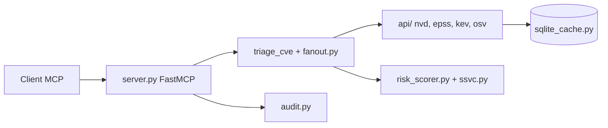

# mukul975/cve-mcp-server

> Serveur MCP de renseignement sécurité qui agrège NVD, EPSS, CISA KEV et d'autres sources pour trier des CVE.

## Le problème
Décider s'il faut corriger une CVE oblige à croiser NVD, EPSS, CISA KEV, dépôts d'exploits et bases de menaces dans plusieurs onglets.

## Ce que ça fait vraiment
Un serveur FastMCP Python exposant une trentaine d'outils (recherche CVE, EPSS, KEV, MITRE ATT&CK, scan de dépendances OSV, IP, malware). L'outil `triage_cve` interroge NVD, EPSS et KEV en parallèle, calcule un score composite de 0 à 100 avec KEV en plancher CRITICAL, et propose une décision SSVC en mode `deep`. Cache SQLite, journal d'audit, transport stdio ou HTTP.

## Comment c'est branché


## Essayer
```bash
git clone https://github.com/mukul975/cve-mcp-server.git
cd cve-mcp-server
python -m venv venv && source venv/bin/activate
pip install -e .
cp .env.example .env
python -m cve_mcp.server
```

## Coût et pièges
Huit outils marchent sans clé ; les autres demandent des clés gratuites à quotas limités (NVD, GitHub, AbuseIPDB, VirusTotal, GreyNoise, Shodan). Toutes les requêtes sortent vers des API tierces. Le README contient un appel à répondre à une enquête universitaire.

## Ce que ce n'est pas
Pas un scanneur actif : consultation seule. Le README est incohérent (28 ou 27 outils, noms de variables `..._API_KEY` et `..._KEY`).

## Alternatives
Aucune alternative nommée dans le README.

## Pour toi
À surveiller : pertinent pour une équipe sécurité IA, mais dépôt jeune, mainteneur unique et documentation incohérente.
