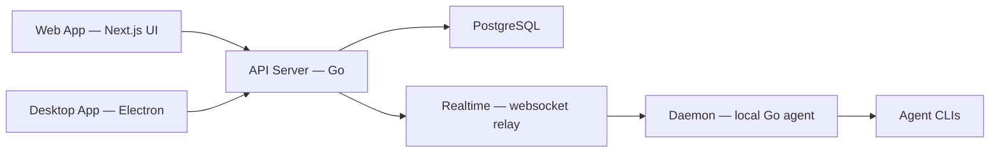

# multica-ai/multica

> Tableau d'issues où des agents de code CLI reçoivent, exécutent et rendent des tâches, pour équipes.

## Le problème
Plusieurs agents (Claude Code, Codex…) tournent chacun dans un terminal, oublient le contexte et doivent être surveillés un à un.

## Ce que ça fait vraiment
Backend Go (Chi, sqlc, WebSocket) + PostgreSQL, clients Next.js, Electron et Expo.
Un daemon local réclame les tâches et lance l'un des 26 CLI d'agents installés sur ta machine.
Assignation d'issues, autopilots cron, squads, skills, logs d'exécution, coût en tokens, passage en revue.
Intégrations GitHub/GitLab/Gitea, Slack, Lark ; auto-hébergement Docker Compose ou Helm.

## Comment c'est branché


## Essayer
```bash
curl -fsSL https://raw.githubusercontent.com/multica-ai/multica/main/scripts/install.sh | bash -s -- --with-server
multica setup self-host
make dev
```

## Coût et pièges
Ne fournit aucun modèle : il faut au moins un CLI d'agent installé et authentifié (abonnements à ta charge). Auto-hébergement : Docker requis.

## Ce que ce n'est pas
Pas un agent ni un LLM : un orchestrateur. iOS seulement à compiler soi-même. `main` bouge presque chaque jour.

## Alternatives
Non documenté.

## Pour toi
Intéressant pour piloter plusieurs agents en équipe ; licence à clarifier avant tout usage sérieux.
