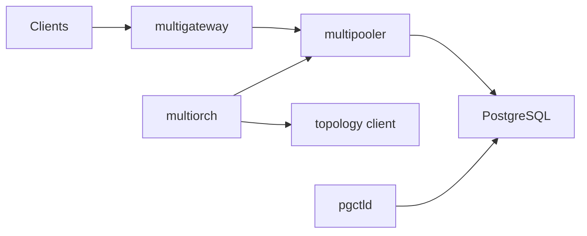

# multigres/multigres

> Adaptation de Vitess pour Postgres : passerelle, pooling et orchestration pour Postgres distribué.

## Le problème
Postgres monte mal en charge horizontalement : pooling, bascule après panne et sauvegardes se bricolent à la main.

## Ce que ça fait vraiment
Le README est très court : projet en phase précoce, renvoie à un site et à un guide EKS. D'après le code : `multigateway` (SQL via protocole Postgres), `multipooler` (pools et gRPC), `multiorch` (bascule et récupération), `multiadmin`, `pgctld` (cycle de vie de Postgres), topologie sur etcd, sauvegardes pgBackRest vers S3.

## Comment c'est branché

## Essayer
Aucune commande documentée dans le README ; il renvoie au site du projet et au guide EKS.

## Coût et pièges
Déploiement multi-services (Docker, Kubernetes/EKS), etcd et stockage objet pour les sauvegardes. Le projet se dit en phase précoce.

## Ce que ce n'est pas
Pas encore un produit stable. README de moins de 800 caractères : la fiche s'appuie surtout sur l'architecture décrite d'après le code.

## Alternatives
- Vitess : le projet dont il est l'adaptation.

## Pour toi
À surveiller : pertinent si tu portes des données à grande échelle sur Postgres, mais trop jeune pour de la production.
