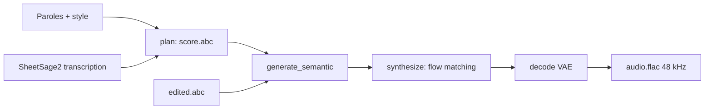

# multimodal-art-projection/YuE

> Génération de chansons complètes à partir de paroles, via un plan musical éditable.

## Le problème
Les générateurs de musique sont des boîtes noires : on ne voit ni la mélodie ni les accords choisis,
donc on ne peut pas corriger une harmonie, seulement regénérer et espérer.

## Ce que ça fait vraiment
YuE2 écrit d'abord un plan mélodie-accords en ABC, puis le réalise en chanson complète avec voix et
accompagnement. Le plan est lisible, jouable et modifiable par un humain ou un agent avant rendu.
Une dorsale AR–NAR Mixture-of-Transformers prédit partition et jetons sémantiques, un flow matching
produit les latents acoustiques, un VAE décode en stéréo 48 kHz. API en étapes : `plan()`,
`generate_semantic()`, `synthesize()`, `decode()`. Trois modes : `cot="full"`, `"melody"` (reprises), `"off"`.

## Comment c'est branché


## Essayer
```bash
git clone https://github.com/multimodal-art-projection/YuE.git
cd YuE
python3.12 -m venv .venv
source .venv/bin/activate
python -m pip install --upgrade pip
python -m pip install .
python examples/generate.py --output outputs/first-song
```

## Coût et pièges
Linux, Python 3.12, GPU NVIDIA compatible BF16 avec **24 Go de VRAM**. Les poids se téléchargent depuis
Hugging Face au premier usage. SheetSage2, nécessaire aux reprises, tourne dans un environnement séparé.

## Ce que ce n'est pas
Pas un éditeur audio : modifier la partition regénère un enregistrement complet, la forme d'onde
d'origine n'est pas préservée. Le README précise lui-même que l'écart entre les meilleures moyennes du
benchmark n'établit **pas** de significativité statistique. Licence non déclarée dans ce README ; des
contacts « licensing inquiries » sont donnés, ce qui suggère des conditions à vérifier.

## Alternatives
- **ACE-Step 1.5** : poids publics, évalué dans le même tableau.
- **DiffRhythm 2** : poids publics, scores inférieurs sur SongBench Avg.
- **SongBloom** : poids publics, dernier du classement cité.

## Pour toi
Curiosité sérieuse : la partition explicite est le premier vrai levier de contrôle en génération musicale.
