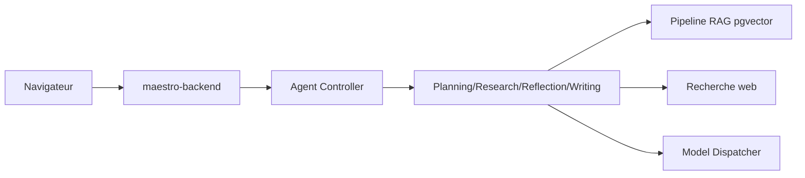

# murtaza-nasir/maestro

> Assistant de recherche IA auto-hébergé : agents qui planifient, cherchent dans tes documents et le web, rédigent des rapports.

## Le problème
Une recherche documentaire longue enchaîne lecture de PDF, recherches web, prise de notes et rédaction, difficiles à confier à un simple chat.

## Ce que ça fait vraiment
Une plateforme multi-agents (planification, recherche, réflexion, rédaction) avec RAG sur tes documents PDF, Word et Markdown (embeddings BGE-M3, PostgreSQL et pgvector), recherche web (Tavily, LinkUp, Jina, SearXNG) et LLM compatibles OpenAI, dont Azure. Les missions peuvent être reprises après pause. Le README décrit la version 0.1.10-alpha.

## Comment c'est branché


## Essayer
```bash
git clone https://github.com/murtaza-nasir/maestro.git
cd maestro
./setup-env.sh
docker compose up -d
docker compose logs -f maestro-backend
```

## Coût et pièges
Docker Compose v2, 16 Go de RAM minimum, 30 Go de disque, démarrage de 5 à 10 minutes. Clés d'API d'au moins un fournisseur ; GPU NVIDIA détecté automatiquement, sinon `docker-compose.cpu.yml`.

## Ce que ce n'est pas
Version alpha. Les notes de version s'arrêtent à octobre 2025, et la description d'architecture fournie (Streamlit, ChromaDB) ne correspond pas au README (PostgreSQL, pgvector, Docker). AGPL-3.0.

## Alternatives
Aucune alternative nommée dans le README.

## Pour toi
À surveiller : cas d'usage proche du tien (recherche assistée sur corpus), mais alpha, un seul mainteneur et documentation contradictoire.
