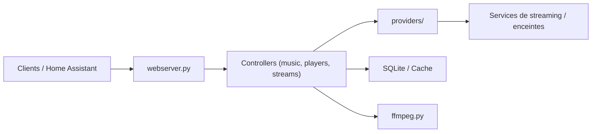

# music-assistant/server

> Serveur de bibliothèque musicale qui relie services de streaming et enceintes connectées, pour la maison.

## Le problème
Écouter sa musique de plusieurs services sur des enceintes de marques différentes passe par autant d'applications.

## Ce que ça fait vraiment
Un serveur Python asynchrone, à laisser allumé (Raspberry Pi, NAS). Des fournisseurs enfichables gèrent musique, lecteurs (Sonos, Chromecast, AirPlay, Snapcast) et métadonnées. Il expose une API HTTP/WebSocket et s'intègre à Home Assistant. Il s'appuie sur ffmpeg et des binaires externes.

## Comment c'est branché


## Essayer
```bash
scripts/setup.sh
python -m music_assistant --log-level debug
pytest
```
Il faut Python 3.14+ et ffmpeg 6.1+. L'installation recommandée est une app Home Assistant.

## Coût et pièges
Gratuit, mais les abonnements de streaming restent à ta charge.

## Ce que ce n'est pas
Pas un lecteur autonome : le serveur est le cœur, l'interface vient d'ailleurs. Non pensé pour un usage professionnel.

## Alternatives
Aucune alternative nommée dans le README.

## Pour toi
À ignorer côté travail : c'est de la domotique musicale, sans lien avec data/IA/MLOps.

