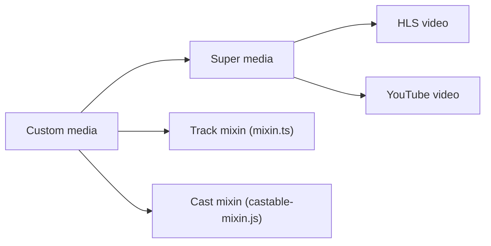

# muxinc/media-elements

> Collection d'éléments HTML compatibles HTMLMediaElement pour piloter YouTube, Vimeo, HLS, DASH et d'autres lecteurs.

## Le problème
Chaque lecteur vidéo tiers a sa propre API, ce qui complique un lecteur unique.

## Ce que ça fait vraiment
Fournit des éléments personnalisés qui exposent l'API native `<video>` ou `<audio>` au-dessus de hls.js, dash.js, Shaka, YouTube, TikTok, Vimeo, Video.js, Spotify, Wistia, JW Player, Twitch, Cloudflare Stream et PeerTube. Modules complémentaires : pistes et renditions, plages lues, diffusion Cast.

## Comment c'est branché


## Essayer
```bash
# Aucune commande dans le README : il contient seulement un tableau des paquets.
```

## Coût et pièges
Gratuit. Licence : aucune déclarée au catalogue. Le README, réduit à un tableau dont les noms de paquets sont absents du texte fourni, ne donne ni installation ni exemple.

## Ce que ce n'est pas
Pas un lecteur complet avec interface : ce sont des éléments à intégrer.

## Alternatives
Aucune alternative nommée dans le README.

## Pour toi
À ignorer : brique front-end vidéo sans lien avec data, IA ou MLOps, et licence non déclarée.

