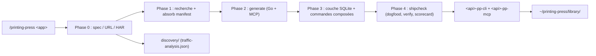

# mvanhorn/cli-printing-press

> Générateur qui transforme une API ou un site en CLI Go, serveur MCP et skill d'agent.

## Le problème
Les générateurs de CLI depuis OpenAPI enrobent les endpoints et s'arrêtent là : un agent doit
enchaîner dix appels pour une question que le domaine permettrait de répondre en un seul.

## Ce que ça fait vraiment
Lit la documentation officielle, étudie les CLI et serveurs MCP communautaires existants, et
reverse-engineere par navigateur les APIs non publiées. Chaque exécution produit deux binaires
(`<api>-pp-cli` en Cobra et `<api>-pp-mcp`), partageant le même `internal/client` et le même
`internal/store`. Les ressources à forte gravité obtiennent des tables SQLite dédiées avec index
FTS5 et synchronisation incrémentale par curseur, ce qui rend possibles des commandes composées
(`stale`, `health`, `bottleneck`, `reconcile`) impossibles à un simple wrapper. Sortie JSON
automatique en pipe, `--compact` pour 60–80 % de jetons en moins, codes de sortie typés
(`0/2/3/4/5/7`) pour que l'agent se corrige sans analyser le texte d'erreur. Quatre vérifications
mécaniques avant publication : scorecard, dogfood, preuve de comportement, smoke test live.

## Comment c'est branché


## Essayer
```bash
curl -fsSL https://raw.githubusercontent.com/mvanhorn/cli-printing-press/main/scripts/install.sh | bash
curl -fsSL https://raw.githubusercontent.com/mvanhorn/cli-printing-press/main/scripts/install.sh | bash -s -- --skills-only --agent codex
go install github.com/mvanhorn/cli-printing-press/v4/cmd/cli-printing-press@latest
npx -y skills@latest add mvanhorn/cli-printing-press/skills --skill '*' -g -a claude-code -y
cli-printing-press --version
claude --plugin-dir .
cli-printing-press mcp-audit
```
Puis, dans l'agent : `/printing-press Notion`, `/printing-press HubSpot codex`,
`/printing-press-polish notion`, `/printing-press-publish linear`, `/printing-press-amend`.

## Coût et pièges
Go 1.26.6+, Node/npm, et un agent supporté. Le coût dominant est en jetons : le README annonce
60 % d'Opus en moins avec le mode `codex`, ce qui dit l'ordre de grandeur du mode par défaut. Une
exécution complète est chiffrée entre 22 et 50 minutes cumulées sur les phases.

## Ce que ce n'est pas
Pas un outil autonome : le binaire seul saute la boucle d'agent curée, les skills seuls n'ont rien à
appeler — les deux sont requis. Pas testé ailleurs que sur Claude Code, le support Codex est annoncé
comme un essai. Le sniffing de trafic sur un site tiers n'est pas neutre juridiquement, et le README
n'en parle pas. Le README est tronqué avant la fin de la section vérification.

## Alternatives
- `discrawl` (Discord) et `gogcli` (Google Workspace) : les CLI artisanales dont le projet s'inspire.
- `schpet/linear-cli`, `4ier/notion-cli` : les CLI communautaires que le press vise à absorber.

## Pour toi
L'idée « couche SQLite locale + commandes composées » vaut plus que le générateur lui-même.
