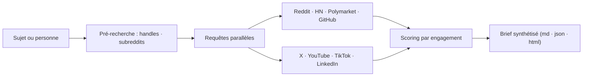

# mvanhorn/last30days-skill

> Skill de recherche multi-plateformes des 30 derniers jours, classée par engagement réel.

## Le problème
Aucun moteur ne couvre à la fois Reddit, X, YouTube, TikTok et Polymarket : chaque plateforme est un jardin clos avec son API et son auth.

## Ce que ça fait vraiment
Interroge en parallèle une vingtaine de sources — Reddit (upvotes et top commentaires, sans clé), Hacker News, Polymarket, GitHub, arXiv, Techmeme, Digg, X, YouTube, TikTok, Instagram, LinkedIn, StockTwits, Bluesky, Perplexity, web — puis un agent juge synthétise une note unique, classée par ce que les gens ont réellement engagé. Modes complémentaires : découverte de sujets (`--discover`), comparaison d'outils, `--hiring-signals`, `--as-of` pour une fenêtre passée, export JSON versionné et HTML autonome.

## Comment c'est branché


## Essayer
```bash
npx skills add mvanhorn/last30days-skill -g
python3 skills/last30days/scripts/last30days.py --preflight
npx skills update last30days -g
```

## Coût et pièges
Reddit, HN, Polymarket, GitHub, arXiv et Techmeme sont gratuits et sans clé. Les autres exigent tes propres clés ou cookies de navigateur : ScrapeCreators (10 000 appels gratuits puis à l'usage), Brave Search (2 000 requêtes/mois), Perplexity à l'usage, X API sur ton projet développeur. Les résultats sont écrits par défaut dans `~/Documents/Last30Days/`.

## Ce que ce n'est pas
Ce n'est pas un moteur unifié : c'est un pont entre des plateformes cloisonnées, dont la disponibilité dépend d'accès qui peuvent casser. Le classement reflète l'engagement, pas la véracité. Windows est partiellement supporté (bundle Claude Desktop différé).

## Alternatives
- TweetClaw : plugin compagnon pour les actions X hors recherche, explicitement non endossé.

## Pour toi
À surveiller : sérieux atout de veille, à condition d'accepter le coût des clés et la fragilité des sources scrapées.
