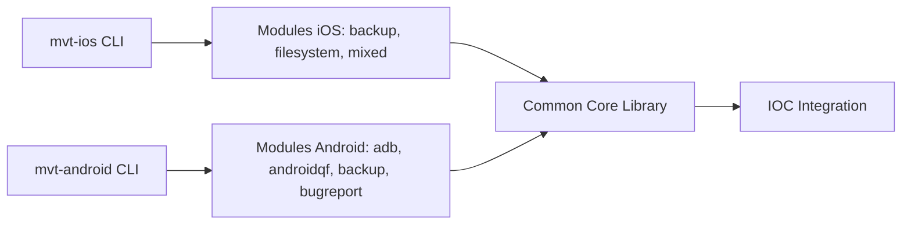

# mvt-project/mvt

> Boîte à outils forensique d'Amnesty pour détecter des traces de compromission sur Android et iOS.

## Le problème
Repérer un spyware comme Pegasus sur un téléphone demande d'acquérir et d'analyser des traces techniques.

## Ce que ça fait vraiment
Trois commandes : `mvt-ios`, `mvt-android` et `mvt` (version, complétion, plugins, `download-iocs`). Analyse des sauvegardes, systèmes de fichiers, rapports de bugs et modules ADB, et compare les traces à des indicateurs de compromission publics. Des plugins ajoutent des modules et des commandes. Publié par Amnesty International Security Lab en 2021.

## Comment c'est branché


## Essayer
```bash
pip3 install mvt
uv tool install mvt
mvt completion bash
```

## Coût et pièges
Gratuit, mais réservé aux profils forensiques. La branche « v3 » a introduit des changements incompatibles qui peuvent casser des scripts. Licence non identifiée par GitHub.

## Ce que ce n'est pas
Pas un outil d'auto-évaluation grand public. Des indicateurs publics ne prouvent pas qu'un appareil est sain.

## Alternatives
Aucune alternative citée dans le README (l'aide du Security Lab d'Amnesty et de l'Access Now Helpline est mentionnée).

## Pour toi
À surveiller : sérieux et bien maintenu, utile seulement si tu fais de l'investigation mobile ; hors périmètre data/IA courant.

