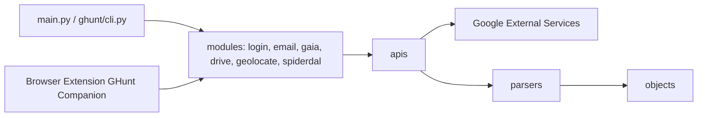

# mxrch/GHunt

> Framework Python en ligne de commande qui interroge des services Google à des fins d'OSINT.

## Le problème
Recouper ce qu'un compte, un fichier partagé ou un identifiant Google laisse d'informations publiques suppose d'appeler à la main plusieurs services et de décoder leurs réponses.

## Ce que ça fait vraiment
Une CLI et une bibliothèque Python entièrement asynchrones. Les modules `email`, `gaia`, `drive`, `geolocate` et `spiderdal` appellent des API Google, dont les réponses sont analysées puis structurées en objets ; l'export JSON est possible. L'authentification passe par la commande `ghunt login`, avec une extension de navigateur (GHunt Companion) ou la saisie de cookies. Une version en ligne existe (osint.industries).

## Comment c'est branché


## Essayer
```bash
pip3 install pipx
pipx ensurepath
pipx install ghunt

ghunt login
ghunt email <email_address> --json user_data.json
```

## Coût et pièges
Gratuit ; Python 3.10 minimum. Il faut un compte Google pour s'authentifier. Le mode d'écoute de `login` n'est pas compatible avec Docker. Pour l'usage en bibliothèque, le README demande `pip3 install ghunt` plutôt que pipx.

## Ce que ce n'est pas
Le README précise que l'outil est à visée éducative, sans responsabilité de l'auteur, et limite l'usage aux enquêtes personnelles ou criminelles, aux tests d'intrusion et aux projets open source, sous AGPL. Il dépend de services Google non documentés pour cet usage : son fonctionnement peut donc casser sans préavis. Ce n'est pas un outil pour cibler des tiers sans base légale.

## Alternatives
- Version en ligne osint.industries, mentionnée dans le README.

## Pour toi
À ignorer : usage OSINT très ciblé, dépendant de Google et d'un mainteneur unique, sans rapport avec un travail data/IA/MLOps ; licence à confirmer (AGPL annoncée, non reconnue par GitHub).

