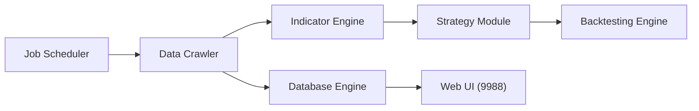

# myhhub/stock

> Système d'analyse quantitative des actions chinoises : données quotidiennes, indicateurs, sélection, rétro-test.

## Le problème
Récupérer chaque jour les données du marché A chinois, calculer indicateurs et motifs de bougies, puis filtrer des titres sans assembler tout cela soi-même.

## Ce que ça fait vraiment
Récupère données d'actions et d'ETF (flux de fonds, dividendes, « dragon-tigre »), calcule une trentaine d'indicateurs avec TA-Lib et pandas, reconnaît 61 formes de chandeliers, calcule la répartition des coûts (« chips »), applique des stratégies de sélection et un rétro-test. Stockage en base MySQL/MariaDB, interface web sur le port 9988, tâches planifiées, option de trading automatique (Windows).

## Comment c'est branché


## Essayer
```bash
docker network create InStockService
docker run -d --name InStockDbService --network InStockService -v /data/mariadb/data:/var/lib/instockdb -e MYSQL_ROOT_PASSWORD=root library/mariadb:latest
docker run -dit --name InStock --network=InStockService -p 9988:9988 -e db_host=InStockDbService mayanghua/instock:latest
python execute_daily_job.py 2022-01-01 2022-03-01
```

## Coût et pièges
Données scrapées auprès de sites tiers (Eastmoney) : proxys et cookie à fournir en cas de blocage. Le README avoue que le tableau de l'interface utilise un composant commercial en version d'évaluation, et renvoie pour Navicat vers un patch de craquage : ne pas suivre. Avertissement d'investissement du README.

## Ce que ce n'est pas
Pas un conseil financier. Le trading automatique déclenche des souscriptions d'introduction en bourse chaque jour à 10 h si le service est lancé.

## Alternatives
Le README ne nomme aucune alternative.

## Pour toi
Ignorer : outil centré sur le marché chinois, documenté en chinois, dépendant de scraping fragile et d'un composant commercial sous licence d'évaluation.

