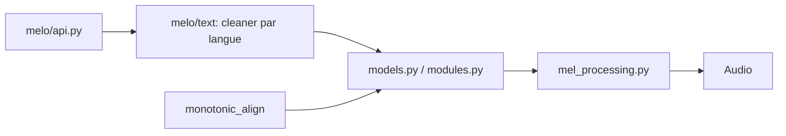

# myshell-ai/MeloTTS

> Bibliothèque de synthèse vocale multilingue, assez rapide pour tourner en temps réel sur CPU.

## Le problème
Obtenir une voix synthétique de qualité en plusieurs langues sans GPU ni service payant.

## Ce que ça fait vraiment
Synthétise la parole en anglais (plusieurs accents), espagnol, français, chinois (avec mélange anglais), japonais, coréen. API Python, interface web et CLI, entraînement sur jeu de données personnalisé possible. Le code décrit un traitement de texte par langue, des modèles type VITS et un module d'alignement.

## Comment c'est branché


## Essayer
```bash
# Aucune commande dans le README : liens vers les guides d'installation et d'usage
```

## Coût et pièges
Gratuit. Dernier push décembre 2024 et 232 issues ouvertes : maintenance faible.

## Ce que ce n'est pas
Pas un clonage de voix ; la liste des voix vient des langues et accents fournis.

## Alternatives
Aucune alternative nommée dans le README.

## Pour toi
Surveiller : TTS multilingue léger utile en prototype vocal, mais maintenance ralentie.

