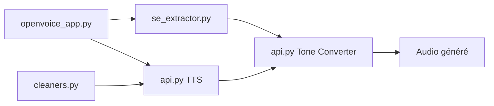

# myshell-ai/OpenVoice

> Clonage de timbre de voix et synthèse vocale multilingue, pour développeurs et chercheurs audio.

## Le problème
Générer une voix ressemblant à une référence, dans plusieurs langues, sans entraîner un modèle par locuteur.

## Ce que ça fait vraiment
Prend un texte et un audio de référence, puis renvoie de l'audio avec le timbre cloné, avec contrôle du style (émotion, accent, rythme, pauses). La V2 prend en charge anglais, espagnol, français, chinois, japonais et coréen. Selon le code, l'API expose la synthèse anglais/chinois et la conversion de timbre ; une application de démonstration complète l'ensemble. MIT, usage commercial libre.

## Comment c'est branché

## Essayer
Aucune commande documentée dans ce README : il renvoie à un fichier d'usage et à une FAQ.

## Coût et pièges
Prérequis matériels non précisés ; un GPU est probable pour un usage confortable, non documenté. Dernier push en avril 2025.

## Ce que ce n'est pas
Pas un service hébergé. Le clonage de voix pose des questions de consentement que ce README ne traite pas.

## Alternatives
Aucune alternative nommée dans le README.

## Pour toi
Surveiller : utile pour prototyper de la voix multilingue, mais l'activité est ancienne et l'installation est à valider toi-même.

