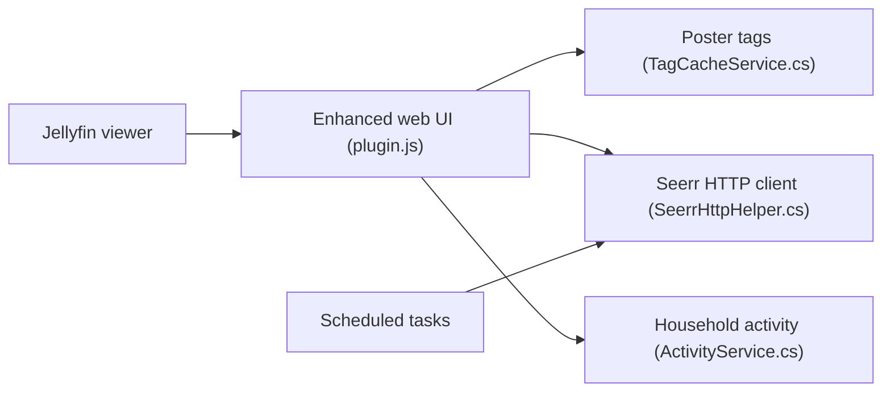

# n00bcodr/Jellyfin-Enhanced

> Plugin Jellyfin qui ajoute raccourcis, étiquettes, intégration Seerr et *arr, pour les administrateurs de serveurs média.

## Le problème
L'interface de Jellyfin manque de fonctions de confort : signets, masquage de contenu, demandes de médias, calendrier.

## Ce que ça fait vraiment
- Raccourcis clavier, signets, écran de pause, saut d'intro (via un plugin tiers).
- Contenu masqué par utilisateur, anti-spoiler appliqué côté serveur.
- Demandes via Seerr, liens et calendrier Sonarr/Radarr, étiquettes de qualité et de langue.
- Nécessite Jellyfin 10.11 ou plus ; non pris en charge sur Android TV.

## Comment c'est branché

## Essayer
Dans Jellyfin : Dashboard, Plugins, Repositories, ajouter
`https://raw.githubusercontent.com/n00bcodr/jellyfin-plugins/main/manifest.json`, puis Catalog, installer, redémarrer.

## Coût et pièges
Gratuit ; les fonctions Seerr et *arr exigent ces services. Le plugin File Transformation est recommandé.

## Ce que ce n'est pas
Pas un serveur média ; pas compatible avec les applications natives sans interface web.

## Alternatives
Le README recommande en complément Custom Tabs, Plugin Pages et Kefin Tweaks.

## Pour toi
À ignorer : confort de média-center personnel, sans rapport avec data/IA/MLOps.

