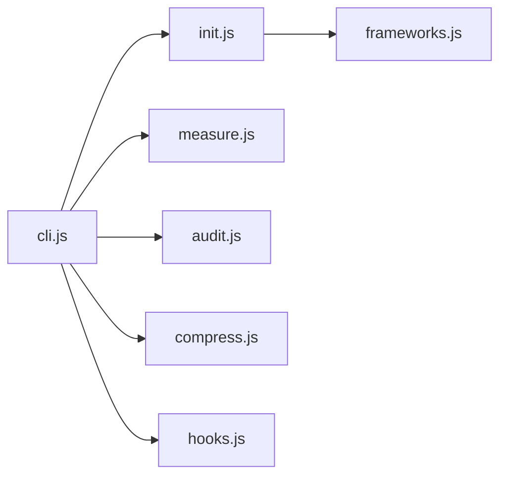

# nadimtuhin/claude-token-optimizer

> CLI qui structure la documentation d'un projet pour que Claude Code charge moins de tokens au démarrage.

## Le problème
Claude Code charge tous les docs au démarrage : l'auteur mesurait 11 000 tokens consommés avant de coder.

## Ce que ça fait vraiment
`cto init` détecte le framework et crée CLAUDE.md, .claudeignore, `.claude/` et `docs/learnings/`. Commandes `measure`, `audit` (19 contrôles, utilisable en CI), `compress`, `prune`, `diff`, `watch`. Fournit des templates de hooks (garde de lecture, injection de contexte par mot-clé, snapshot de session). Estimations de tokens basées sur le tokenizer Claude 2.

## Comment c'est branché


## Essayer
```bash
npx claude-token-optimizer measure
npx claude-token-optimizer init
cto audit --json
cto hooks install --all
```

## Coût et pièges
Gratuit. Les chiffres (11 000 → 1 300) viennent d'un projet de l'auteur ; le gain varie.

## Ce que ce n'est pas
Pas une mesure exacte des tokens facturés. N'optimise pas le code, seulement la doc chargée.

## Alternatives
- Claude Workflows : complémentaire, optimise les processus plutôt que la doc.

## Pour toi
À adopter à l'essai : `measure` coûte peu et révèle vite le gaspillage de contexte d'un gros CLAUDE.md.

