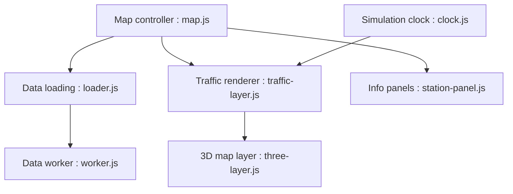

# nagix/mini-tokyo-3d

> Carte 3D en temps réel des transports publics de Tokyo, dans le navigateur.

## Le problème
Visualiser en direct trains et avions de la région de Tokyo sur une carte.

## Ce que ça fait vraiment
Charge données statiques et horaires, rafraîchit la position des véhicules et les rend avec Mapbox et Three.js (calcul de mouvement sur textures GPU). Recherche d'itinéraires, mode souterrain, lecture différée, suivi d'un train. Les données viennent du Public Transportation Open Data Center.

## Comment c'est branché


## Essayer
```bash
npm install
MAPBOX_ACCESS_TOKEN=<token> MT3D_SECRET_ODPT=<token> MT3D_SECRET_CHALLENGE=<token> npm run build-all
```

## Coût et pièges
Pour reconstruire, il faut des jetons Mapbox et ODPT (deux jetons chez ODPT). Une démo en ligne existe pour essayer sans rien configurer.

## Ce que ce n'est pas
Pas un outil généraliste de cartographie : centré sur les données de transport japonaises.

## Alternatives
Aucune alternative nommée dans le README.

## Pour toi
À surveiller : exemple de référence de visualisation temps réel (données ouvertes, rendu GPU), à lire plutôt qu'à déployer.

