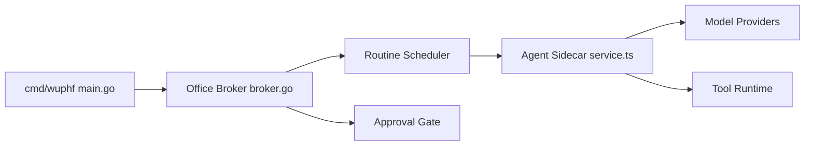

# najmuzzaman-mohammad/gawkbot

> Bureau local de bots IA qui transforment un flux de travail décrit en une phrase en micro-application supervisée.

## Le problème
Automatiser des tâches manuelles (CRM, courriels, messages) par un agent demande de construire l'interface, les routines et les garde-fous soi-même.

## Ce que ça fait vraiment
Tu décris un flux ; un bot est construit en direct avec une interface, des routines planifiées (cron, prompts versionnés), des outils, des pages de connaissances citées, des tables typées et plus de 1 200 intégrations. Il s'appuie sur une CLI de bot déjà connectée (Claude Code par défaut, Codex, Opencode, Ollama, Hermes, OpenClaw). Toute écriture externe attend un clic d'approbation.

## Comment c'est branché


## Essayer
```bash
npx gawkbot
npm install -g gawkbot && gawkbot
gawkbot share
```

## Coût et pièges
Gratuit, mais les appels au modèle sont à ta charge (un bot coûte de 1 à 2 dollars sur Claude Code). Composio, hébergé, sert aux intégrations. Analytique et enregistrement de sessions activés par défaut mais inactifs sans clé PostHog.

## Ce que ce n'est pas
Pas du logiciel libre au sens OSI : licence Sustainable Use, non identifiée par GitHub. Le README se dit open source, annonce des « ordinateurs de bot » en VM locale, puis précise « pas encore ». Le ton est en partie parodique.

## Alternatives
Rakazo, OpenMausBot et OpenBot, cités dans le README comme autres alternatives ouvertes.

## Pour toi
À ignorer : jeune, licence non standard, README contradictoire, et le gain reste flou face à ce que fait un agent de code seul.
