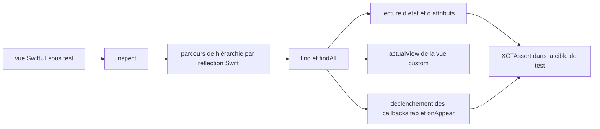

# nalexn/ViewInspector

> **Unit testing for SwiftUI views**, for Apple developers who want to assert output without UI tests.

## The problem

A SwiftUI view is a function of state: you can feed it input but you cannot observe the
output. Without a tool the view hierarchy stays a black box, leaving only slow full UI tests
to check that a button or a piece of text is actually there.

## What it actually does

The library traverses the view hierarchy at runtime and gives direct access to the underlying
`View` structs. In practice: `find` / `findAll` functions to locate a view by type or by
condition, reading the inner parameters of standard views (the rendered string for a given
`Locale`, the font via `attributes().font()`), obtaining a real copy of a custom view with its
actual state and references (`actualView()`), and triggering system-control callbacks to
simulate interaction (`tap()`, `callOnAppear()`). It handles `@Binding`, `@State`,
`@ObservedObject` and `@EnvironmentObject`, and ships helpers for asynchronous tests of views
with callbacks.

## How it is wired



The README does not describe the file tree; the diagram only follows the documented call
path. The entry point is `inspect()` on the view, and traversal uses the official Swift
reflection API rather than private APIs. Two companion documents carry the detail:
`guide.md` (inspection guide) and `readiness.md` (SwiftUI API coverage, view by view and
modifier by modifier).

## Trying it

The README gives no shell command: installation goes through Apple package managers, with
these references as written.

```
# Swift Package Manager
https://github.com/nalexn/ViewInspector

# Carthage
github "nalexn/ViewInspector"

# CocoaPods
pod 'ViewInspector'
```

Usage, copied from the README:

```swift
try sut.inspect().find(button: "Back")
let sut = try view.inspect().find(CustomView.self).actualView()
try sut.inspect().find(button: "Close").tap()
```

## Cost and traps

Free, nothing to pay, no key and no third-party service. The trap is spelled out in the
README: add the framework to the **unit-test target** and definitely not to the main build
target. Another practical limit: SwiftUI API coverage is not complete, so check
`readiness.md` to know whether the target view or modifier is supported; if it is not, the
suggested path is to open an issue or crack it yourself. The repository is run by a single
person, who says they prioritise which APIs get covered.

## What it is not

It is not a UI-testing framework: nothing is rendered on screen, no touch is simulated, the
callbacks are called directly. It is not visual regression testing either, nor a replacement
for XCTest — it is an inspection layer used inside ordinary XCTest assertions. And it is not
universal: only the views and modifiers listed in `readiness.md` can be inspected.

## Alternatives

No comparable alternative in the catalogue: the suggested neighbours
(lucaszischka/BottomSheet, adaptyteam/AdaptySDK-iOS, SwifterSwift/SwifterSwift,
MrKai77/Loop) are UI components, a subscription SDK or macOS utilities, unrelated to testing
SwiftUI views. The README names no competitor, only the author's own sample project,
nalexn/clean-architecture-swiftui, which uses it.

## For you

Outside the data / AI / MLOps scope: this is pure Apple-ecosystem tooling. Worth keeping only
if you also maintain an iOS or macOS SwiftUI app — in that case it is the standard answer for
testing views. Otherwise, walk past.
