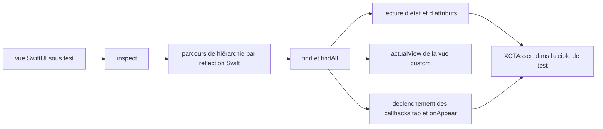

# nalexn/ViewInspector

> **Tests unitaires de vues SwiftUI**, pour développeurs Apple qui veulent vérifier l'affichage sans UI-tests.

## Le problème

Une vue SwiftUI est une fonction de l'état : on peut lui fournir l'entrée, mais pas observer
la sortie. Sans outil, la hiérarchie de vues reste une boîte noire et il ne reste que les
tests d'interface complets, lents, pour vérifier qu'un bouton ou un texte est bien là.

## Ce que ça fait vraiment

La bibliothèque parcourt la hiérarchie de vues à l'exécution et rend accessibles les structs
`View` sous-jacentes. Concrètement : des fonctions `find` / `findAll` pour localiser une vue
par type ou par condition, la lecture des paramètres internes des vues standard (le texte
rendu avec une `Locale` donnée, la police via `attributes().font()`), la récupération d'une
copie réelle d'une vue personnalisée avec son état et ses références (`actualView()`), et le
déclenchement des callbacks système pour simuler une interaction (`tap()`, `callOnAppear()`).
Elle sait manipuler `@Binding`, `@State`, `@ObservedObject` et `@EnvironmentObject`, et
fournit des aides pour les tests asynchrones de vues à callbacks.

## Comment c'est branché



Le README ne décrit pas l'arborescence des fichiers ; le schéma reprend seulement le chemin
d'appel documenté. Le point d'entrée est `inspect()` sur la vue ; le parcours s'appuie sur
l'API officielle de reflection de Swift, pas sur des API privées. Deux documents annexes du
dépôt portent le détail : `guide.md` (guide d'inspection) et `readiness.md` (couverture de
l'API SwiftUI, vue par vue et modificateur par modificateur).

## Essayer

Le README ne donne pas de commande shell : l'installation passe par les gestionnaires de
paquets Apple, avec ces références telles qu'écrites.

```
# Swift Package Manager
https://github.com/nalexn/ViewInspector

# Carthage
github "nalexn/ViewInspector"

# CocoaPods
pod 'ViewInspector'
```

Usage, extraits du README :

```swift
try sut.inspect().find(button: "Back")
let sut = try view.inspect().find(CustomView.self).actualView()
try sut.inspect().find(button: "Close").tap()
```

## Coût et pièges

Gratuit, rien à payer, aucune clé ni service tiers. Le piège est explicite dans le README :
il faut ajouter le framework à la **cible de tests unitaires** et surtout pas à la cible de
build principale. Autre limite pratique : la couverture de l'API SwiftUI n'est pas totale,
il faut consulter `readiness.md` pour savoir si la vue ou le modificateur visé est supporté ;
si non, la voie proposée est d'ouvrir une issue ou de contribuer soi-même. Le dépôt est mené
par une seule personne, qui dit prioriser elle-même les API à couvrir.

## Ce que ce n'est pas

Ce n'est pas un framework de tests d'interface : rien n'est rendu à l'écran, aucune
simulation de doigt, on appelle directement les callbacks. Ce n'est pas non plus un outil de
tests de non-régression visuelle ni un remplaçant de XCTest — c'est une couche d'inspection
qu'on utilise dans des assertions XCTest classiques. Et ce n'est pas universel : seules les
vues et modificateurs listés dans `readiness.md` sont inspectables.

## Alternatives

Aucune alternative comparable dans le catalogue : les voisins proposés
(lucaszischka/BottomSheet, adaptyteam/AdaptySDK-iOS, SwifterSwift/SwifterSwift,
MrKai77/Loop) sont des composants d'interface, un SDK d'abonnements ou des utilitaires macOS,
sans rapport avec le test de vues SwiftUI. Le README ne cite aucun concurrent, seulement le
projet d'exemple du même auteur, nalexn/clean-architecture-swiftui, qui s'en sert.

## Pour toi

Hors périmètre data / IA / MLOps : c'est un outil d'écosystème Apple pur. À retenir seulement
si tu maintiens une app iOS ou macOS en SwiftUI à côté — dans ce cas c'est la réponse
standard pour tester les vues. Sinon, passer son chemin.
