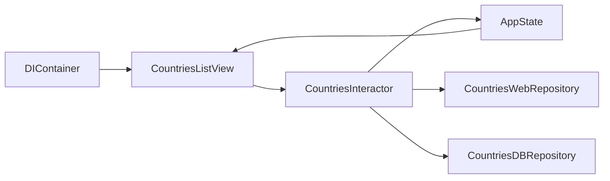

# nalexn/clean-architecture-swiftui

> Application de démonstration iOS montrant une Clean Architecture avec SwiftUI et Combine.

## Le problème
Structurer une app SwiftUI sans mettre la logique métier dans les vues.

## Ce que ça fait vraiment
Une app exemple liste des pays via l'API restcountries.com. Trois couches : vues SwiftUI sans logique, Interactors (logique métier, qui écrivent dans un `AppState` central), Repositories (web et base SwiftData). Injection par `@Environment`, navigation programmatique, liens profonds, réseau en async/await, tests dont l'UI (ViewInspector). Une branche `mvvm` propose la variante MVVM.

## Comment c'est branché

## Essayer
Aucune commande documentée : ouvrir le projet dans Xcode et lancer l'app.

## Coût et pièges
Gratuit. Nécessite macOS et Xcode ; dernier push juillet 2025.

## Ce que ce n'est pas
Pas une bibliothèque réutilisable : un exemple à lire ou copier.

## Alternatives
Aucune nommée dans le README (mention d'une branche MVVM du même dépôt).

## Pour toi
À ignorer : pur développement iOS, sans rapport avec data/IA/MLOps.

