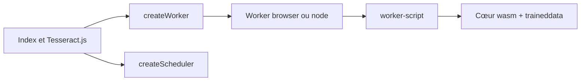

# naptha/tesseract.js

> Reconnaissance de texte dans des images, en JavaScript, dans le navigateur ou sous Node.js.

## Le problème
Extraire du texte d'images sans serveur OCR dédié ni appel à une API payante, y compris côté navigateur.

## Ce que ça fait vraiment
Le dépôt enveloppe le moteur Tesseract compilé en WebAssembly (`tesseract.js-core`). Un worker est créé une fois, charge le cœur wasm et les données de langue, puis traite chaque image ; un scheduler répartit les tâches sur plusieurs workers. Les sorties autres que `text` sont désactivées par défaut depuis la v6.

## Comment c'est branché


## Essayer
```bash
npm install tesseract.js
yarn add tesseract.js
# Développement :
git clone https://github.com/naptha/tesseract.js.git
cd tesseract.js
npm install
npm start
```

## Coût et pièges
Gratuit. Le premier lancement télécharge cœur et langues (mis en cache). Il faut créer le worker une fois puis le réutiliser, pas un par image. Node 16 ou plus pour la v7.

## Ce que ce n'est pas
Ce n'est pas un OCR amélioré : le README dit qu'il ne modifie pas le modèle de reconnaissance et ne gère pas les PDF.

## Alternatives
- Scribe.js : pour les PDF et les améliorations du modèle, hors périmètre de ce dépôt.

## Pour toi
À adopter si tu as besoin d'un OCR simple et local sur des images ; passe par Scribe.js dès qu'il y a des PDF.

