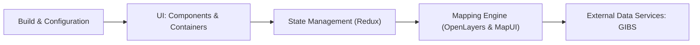

# nasa-gibs/worldview

> Interface web de la NASA pour parcourir plus de 1000 couches d'imagerie satellite mondiale.

## Le problème
Explorer et comparer des images satellites de dates et de capteurs différents demande de jongler entre services et formats.

## Ce que ça fait vraiment
Client web (React/Redux, OpenLayers) qui affiche l'imagerie du service GIBS de la NASA : couches mises à jour quotidiennement, historique jusqu'à environ 30 ans, vues Arctique/Antarctique, imagerie géostationnaire toutes les 10 minutes sur 90 jours. La configuration des couches est pilotée par des fichiers JSON traités à la construction. Les données sont téléchargeables.

## Comment c'est branché


## Essayer
```bash
git clone https://github.com/nasa-gibs/worldview.git
cd worldview
npm ci
npm run build
npm start
```
Puis http://localhost:3000.

## Coût et pièges
Gratuit ; Node LTS requis (Git Bash sous Windows). Dépend du service GIBS distant. Fichier de licence présent mais non reconnu par GitHub.

## Ce que ce n'est pas
Pas un outil d'analyse : c'est un visualiseur. Les données restent chez la NASA.

## Alternatives
Leaflet, Cesium, Google Maps ou scripts GDAL, cités comme autres clients possibles de GIBS.

## Pour toi
À surveiller : source d'images pour projets géospatiaux ou de vision, mais visualiseur d'abord ; licence à confirmer.

