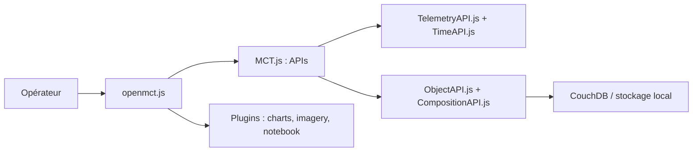

# nasa/openmct

> Cadre web extensible de visualisation de télémétrie pour le contrôle de mission et la planification.

## Le problème
Les opérateurs de missions ont besoin d'une interface unique pour parcourir des objets de mission et visualiser des données temporelles.

## Ce que ça fait vraiment
Application web à plugins : API d'objets, de composition, de télémétrie et de temps ; plugins pour graphiques, imagerie, carnet de bord, plans, conditions et gestion de pannes. Persistance locale ou CouchDB. Le README précise qu'il s'utilise comme dépendance, derrière un serveur HTTP.

## Comment c'est branché


## Essayer
```bash
git clone https://github.com/nasa/openmct.git
nvm install
npm install
npm start
```
Puis ouvrir http://localhost:8080/.

## Coût et pièges
Gratuit. Avec `ignore-scripts` activé, une dépendance par git exige `npm run build`. Le support de l'API legacy (v2.0.0) est retiré ; 1 093 issues ouvertes.

## Ce que ce n'est pas
Pas un produit clé en main : il faut brancher sa source de télémétrie (ex. plugin YAMCS). Licence présente mais non identifiée par GitHub.

## Alternatives
- openmct-quickstart : exemple avec Apache, YAMCS et CouchDB.
- openmct-tutorial : point de départ pour débuter.

## Pour toi
À surveiller si tu dois afficher des séries temporelles d'un système industriel ou IoT ; hors de ce cas, rien pour data/IA.

