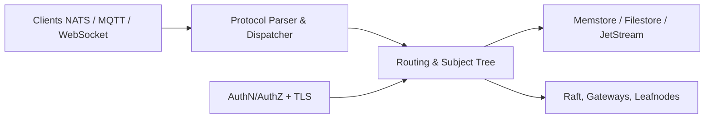

# nats-io/nats-server

> Serveur de messagerie NATS, projet CNCF, pour relier services et appareils par publication/abonnement.

## Le problème
Des services distribués ont besoin d'un bus de messages simple, sûr et rapide, du serveur au cloud jusqu'au poste de bord.

## Ce que ça fait vraiment
Serveur en Go : publication/abonnement, requête/réponse et persistance (JetStream). D'après l'architecture décrite : protocoles NATS, MQTT et WebSocket ; arbre de sujets ; stockage mémoire ou fichier ; clustering Raft, passerelles et leafnodes ; authentification (NKEY, JWT, LDAP) ; rechargement de configuration à chaud ; API HTTP de supervision. Plus de 40 clients de langages existent, d'après le README.

## Comment c'est branché

## Essayer
Aucune commande documentée dans le README (renvoi au site et à la documentation).

## Coût et pièges
Gratuit, Apache-2.0. Le README cite un audit de sécurité par Trail of Bits (avril 2025). Le déploiement en cluster demande de lire la documentation externe.

## Ce que ce n'est pas
Ce n'est pas une file de tâches ML clé en main ni un orchestrateur : c'est le bus de messages.

## Alternatives
Aucune alternative citée dans le README.

## Pour toi
Surveiller : candidat crédible pour relier des services d'inférence ou de collecte en MLOps, à évaluer sur ton besoin de persistance et d'échelle.

