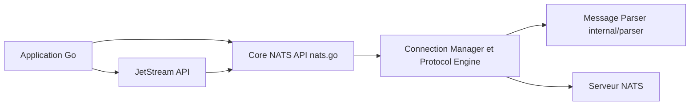

# nats-io/nats.go

> Client Go officiel pour le système de messagerie NATS, avec JetStream et une API de services.

## Le problème
Faire dialoguer des services par messages (publication, abonnement, requête-réponse) avec persistance et reconnexion.

## Ce que ça fait vraiment
Connexion, publish/subscribe, files de groupes, jokers de sujets, requêtes-réponses, authentification par identifiants et Nkeys, TLS, reconnexion en grappe. L'API JetStream ajoute flux et consommateurs persistants ; une API de services (`micro`) est en bêta. Compatibilité ascendante : les champs ajoutés aux structures et les méthodes ajoutées aux interfaces ne sont pas des ruptures.

## Comment c'est branché


## Essayer
```bash
go get github.com/nats-io/nats.go@latest
```
```go
nc, _ := nats.Connect(nats.DefaultURL)
nc.Publish("foo", []byte("Hello World"))
```

## Coût et pièges
Un serveur NATS est nécessaire. Nkeys et identifiants exigent un serveur en version 2.0 minimum. La bibliothèque supporte au moins les deux dernières versions mineures de Go.

## Ce que ce n'est pas
Pas le serveur NATS lui-même (dépôt nats-server), ni un client pour d'autres langages. L'API `micro` est en bêta.

## Alternatives
Aucune alternative nommée dans le README (qui renvoie vers « NATS by example »).

## Pour toi
À surveiller : à retenir si tu construis des services Go de streaming ou de messagerie autour de tes pipelines ; sinon un client Python suffit.

