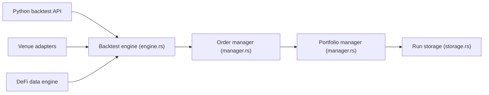

# nautechsystems/nautilus_trader

> Moteur de trading multi-actifs en Rust, piloté en Python, pour backtests et exécution réelle.

## Le problème
La recherche de stratégies se fait souvent en Python vectorisé, puis on réécrit tout dans un système événementiel compilé pour la production.

## Ce que ça fait vraiment
Un cœur Rust événementiel exécute la même stratégie en backtest déterministe et en live, avec Python comme plan de contrôle via PyO3. Des adaptateurs relient des places de marché (Binance, Bybit, Interactive Brokers, Betfair, Polymarket, Databento…). Backtests multi-places à la nanoseconde, types d'ordres avancés, persistance Redis facultative, images Docker et JupyterLab. Le README prévient que le live diffère de la simulation.

## Comment c'est branché


## Essayer
```bash
pip install -U nautilus_trader --pre
docker pull ghcr.io/nautechsystems/jupyterlab:nightly --platform linux/amd64
docker run -p 8888:8888 ghcr.io/nautechsystems/jupyterlab:nightly
```

## Coût et pièges
Gratuit. Les wheels v2 sont des candidates de version (2.0.0rcN) : le README déconseille le live avec du capital réel. Sans --pre, pip installe la v1 aux API différentes. Linux : glibc 2.35 ou plus. Licence LGPL-3.0. Rust requis seulement pour compiler.

## Ce que ce n'est pas
Pas un robot clé en main ni un gage de rentabilité. Des changements incompatibles peuvent survenir entre versions.

## Alternatives
Aucune alternative citée dans le README.

## Pour toi
À surveiller : intéressant pour du backtest événementiel rigoureux avec du ML, mais v2 encore en candidate de version, LGPL et domaine niche.

