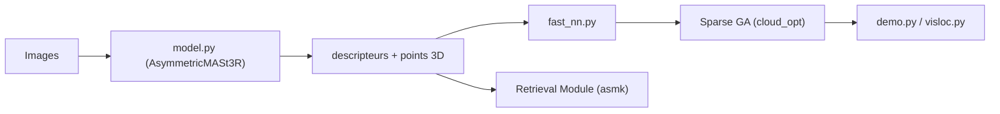

# naver/mast3r

> Implémentation officielle de MASt3R : appariement d'images ancré en 3D, pour chercheurs en vision.

## Le problème
Les méthodes classiques d'appariement d'images échouent quand les points de vue sont très différents.

## Ce que ça fait vraiment
Le modèle prédit des points 3D et des descripteurs pour une paire d'images, puis en tire des correspondances 2D-2D (`fast_reciprocal_NNs`). Un module de récupération et un alignement global épars (MASt3R-SfM) traitent des scènes plus grandes. Le dépôt contient aussi la localisation visuelle (`visloc.py`), l'entraînement et un démo Gradio.

## Comment c'est branché


## Essayer
```bash
git clone --recursive https://github.com/naver/mast3r
conda create -n mast3r python=3.11 cmake=3.14.0
pip install -r requirements.txt
python3 demo.py --model_name MASt3R_ViTLarge_BaseDecoder_512_catmlpdpt_metric
```

## Coût et pièges
GPU CUDA recommandé, sous-module dust3r et compilation d'ASMK. Les poids sont sous CC-BY-NC-SA 4.0, avec des jeux d'entraînement restrictifs (Mapfree).

## Ce que ce n'est pas
Pas un outil de reconstruction prêt pour la production : les scripts colmap/glomap sont des « jouets » peu testés. Usage commercial des poids restreint.

## Alternatives
- DUSt3R : modèle antérieur dont MASt3R est issu.

## Pour toi
À surveiller pour la vision 3D en recherche : bons résultats publiés, mais licence non commerciale et dépôt sans commit depuis juin 2025.

