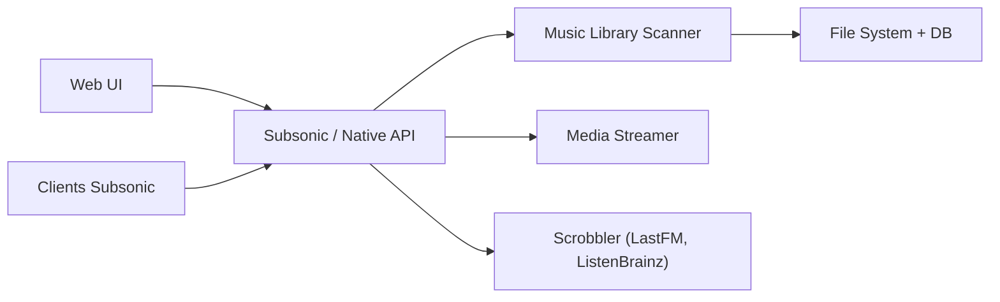

# navidrome/navidrome

> Serveur de streaming musical auto-hébergé, compatible avec les clients Subsonic.

## Le problème
Écouter sa propre collection musicale à distance sans dépendre d'un service de streaming.

## Ce que ça fait vraiment
Indexe une grande bibliothèque, surveille les changements, lit ses métadonnées et diffuse presque tout format audio avec transcodage à la volée (Opus compris). Multi-utilisateur (lectures, playlists, favoris par personne), paroles synchronisées, interface web Material UI, compatible Subsonic/Madsonic/Airsonic. Binaires pour Linux, macOS, Windows, Raspberry Pi, et images Docker. Hébergement cloud proposé via PikaPods.

## Comment c'est branché

## Essayer
Aucune commande documentée dans le README fourni ; installation sur le site du projet.

## Coût et pièges
Gratuit ; PikaPods est une option payante. Il faut posséder les fichiers musicaux. GPL-3.0.

## Ce que ce n'est pas
Ce n'est pas un service de streaming avec catalogue : il ne sert que ta bibliothèque locale.

## Alternatives
Aucune alternative nommée dans le README.

## Pour toi
Ignorer : usage domestique sans rapport avec la data ni le MLOps, sauf comme exemple d'auto-hébergement simple.

