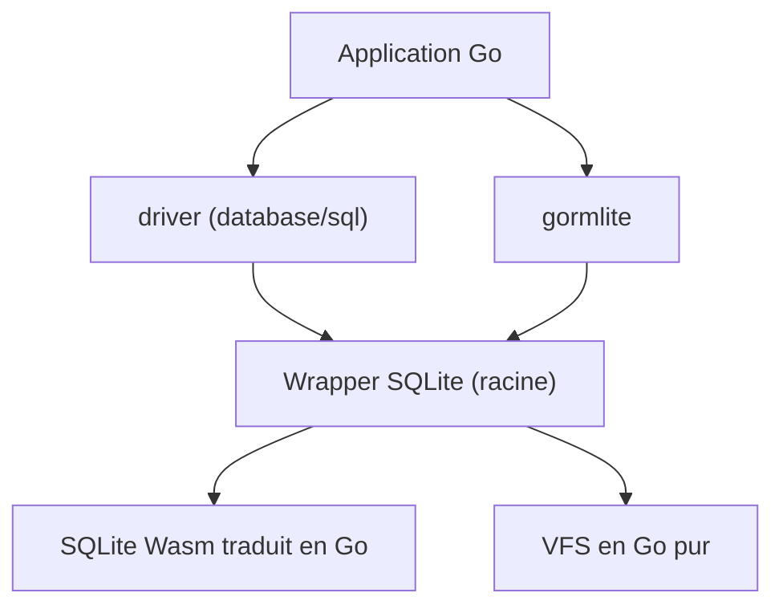

# ncruces/go-sqlite3

> Binding Go de SQLite sans cgo, via un build Wasm traduit en Go.

## Le problème
Utiliser SQLite en Go impose souvent cgo, ce qui complique la compilation croisée.

## Ce que ça fait vraiment
Enveloppe un SQLite compilé en Wasm et traduit en Go par wasm2go ; seuls Go et `x/sys` sont requis. Fournit un driver `database/sql`, l'API C directe, un VFS en Go pur et un driver GORM. Inclut I/O de BLOB incrémental, transactions imbriquées, fonctions et tables virtuelles personnalisées, sauvegarde en ligne, JSON, chiffrement au repos, extensions.

## Comment c'est branché


## Essayer
```go
import "database/sql"
import _ "github.com/ncruces/go-sqlite3/driver"

var version string
db, _ := sql.Open("sqlite3", "file:demo.db")
db.QueryRow(`SELECT sqlite_version()`).Scan(&version)
```

## Coût et pièges
Gratuit. Chaque connexion s'exécute dans un bac à sable Wasm : consommation mémoire plus élevée. Une connexion ne doit pas être partagée entre goroutines.

## Ce que ce n'est pas
Pas un SQLite « natif » : le VFS est remplacé par une implémentation Go, avec des limites selon système/CPU (matrice de support dans la doc).

## Alternatives
Le README parle d'« alternatives » sans les nommer.

## Pour toi
À surveiller : sert seulement si tu écris du Go et veux éviter cgo ; sans intérêt en Python.
