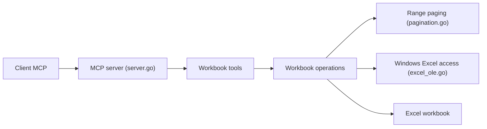

# negokaz/excel-mcp-server

> Serveur MCP qui lit et écrit des fichiers Excel pour des assistants IA.

## Le problème
Un assistant IA ne sait pas manipuler directement un classeur Excel : valeurs, formules, formats, feuilles.

## Ce que ça fait vraiment
Expose via MCP sur stdio sept outils : décrire les feuilles, lire (avec pagination, formules et styles), écrire, créer un tableau, copier une feuille, formater une plage et, sous Windows seulement, capturer l'écran d'une feuille. La modification en direct est aussi réservée à Windows.

## Comment c'est branché


## Essayer
```bash
npx --yes @negokaz/excel-mcp-server
```

## Coût et pièges
Gratuit. Node.js 20+. Limite de lecture de 4000 cellules par défaut (EXCEL_MCP_PAGING_CELLS_LIMIT). Dernier push en juillet 2025, 32 issues ouvertes.

## Ce que ce n'est pas
Pas une bibliothèque d'analyse de données : il ne calcule pas. Les fonctions les plus riches exigent Windows.

## Alternatives
Aucune alternative nommée dans le README.

## Pour toi
À surveiller : utile pour automatiser des classeurs via un agent, mais sans activité depuis plus d'un an ; vérifie qu'il tient avant de t'y appuyer.

