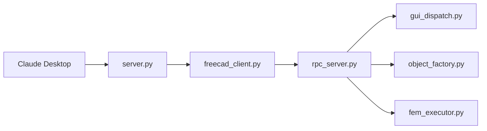

# neka-nat/freecad-mcp

> Serveur MCP qui laisse Claude Desktop piloter FreeCAD : modèles, scripts Python, inspection, analyses FEM.

## Le problème
Modéliser en CAO demande de manipuler l'interface FreeCAD ou d'écrire des scripts ; un assistant IA ne peut pas y toucher sans pont.

## Ce que ça fait vraiment
Deux processus : un serveur MCP (`server.py`) lancé par le client via `uvx`, et un addon FreeCAD qui héberge un serveur RPC local. Le client MCP traduit les appels d'outils en appels RPC vers l'addon, qui exécute sur le thread GUI (`gui_dispatch.py`). Création d'objets validée, exécution de scripts Python et jobs FEM se font côté addon. Connexions sur `localhost` par défaut, avec un filtre IP.

## Comment c'est branché


## Essayer
```bash
git clone https://github.com/neka-nat/freecad-mcp.git
cd freecad-mcp
```
Copier `addon/FreeCADMCP` dans le dossier d'addons FreeCAD, redémarrer, lancer « Start RPC Server », puis ajouter dans `claude_desktop_config.json` : commande `uvx`, args `["freecad-mcp"]`.

## Coût et pièges
Gratuit ; FreeCAD et uv/uvx requis. FreeCAD doit rester ouvert avec son serveur RPC démarré. Exposer le RPC hors `localhost` est un choix explicite.

## Ce que ce n'est pas
Ce n'est pas un remplaçant de FreeCAD : il pilote l'application ouverte. Il exécute du Python dans FreeCAD, donc à ne pas ouvrir au réseau sans précaution.

## Alternatives
- Aucune alternative nommée dans le README.

## Pour toi
Surveiller : utile seulement si tu fais de la CAO avec un assistant ; hors de ton cœur data/IA, mais le patron pont MCP + RPC local est instructif.
