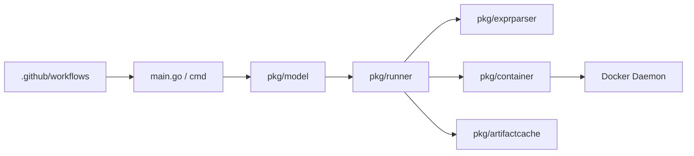

# nektos/act

> CLI Go qui exécute localement, dans Docker, les workflows GitHub Actions d'un dépôt.

## Le problème
Pour tester une modification de `.github/workflows/`, il faut commiter et pousser, puis attendre le runner : des boucles de feedback lentes.

## Ce que ça fait vraiment
`act` lit `.github/workflows/`, calcule les actions à lancer et l'ordre d'exécution d'après les dépendances, tire ou construit les images nécessaires via l'API Docker, puis lance un conteneur par action avec des variables d'environnement et un système de fichiers calqués sur ceux de GitHub.
Côté code : `pkg/model` (workflows), `pkg/runner` (jobs et étapes), `pkg/exprparser` (expressions `${{ }}`), `pkg/container` (Docker), `pkg/artifactcache` (cache et artefacts).
Sert aussi de lanceur de tâches local à la place d'un `Makefile`.

## Comment c'est branché


## Essayer
```bash
git clone git@github.com:nektos/act.git
make test
make install
```

## Coût et pièges
Gratuit, MIT. Docker obligatoire ; les images de runner à tirer ou construire pèsent sur disque et réseau. Compilation : Go 1.20+.

## Ce que ce n'est pas
Pas un service de CI : tout tourne sur ta machine. Le README ne détaille pas l'usage : il renvoie à un guide utilisateur externe. L'analyse d'architecture fournie est générique.

## Alternatives
- GitHub Local Actions (extension VS Code) — pour piloter `act` depuis l'éditeur ; elle s'appuie sur `act`.

## Pour toi
À adopter pour déboguer tes pipelines CI de ML sans multiplier les pushs.
