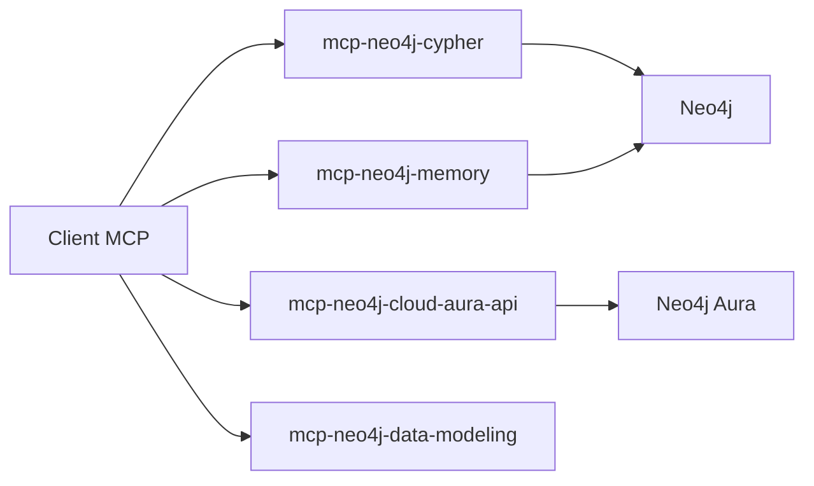

# neo4j-contrib/mcp-neo4j

> Serveurs MCP Neo4j Labs pour interroger, mémoriser et modéliser des graphes Neo4j depuis un assistant IA.

## Le problème
Un assistant doit parler à une base graphe, générer du Cypher et garder une mémoire durable sans code d'intégration.

## Ce que ça fait vraiment
Quatre serveurs : `mcp-neo4j-cypher` (schéma et requêtes lecture/écriture ; APOC requis), `mcp-neo4j-memory` (graphe de connaissances), `mcp-neo4j-cloud-aura-api` (gérer des instances Aura) et `mcp-neo4j-data-modeling` (modèles, import/export Arrows.app). Transports stdio, SSE et HTTP ; conteneurisés pour ECS Fargate ou Azure Container Apps.

## Comment c'est branché


## Essayer
```bash
mcp-neo4j-cypher --transport http
mcp-neo4j-cypher --transport http --host 127.0.0.1 --port 8080 --path /api/mcp/
```

## Coût et pièges
Il faut une instance Neo4j (ou Aura, potentiellement payant). Programme Labs : « pas de SLA ni de garantie de compatibilité ascendante ». Autoriser un LLM à écrire du Cypher sur une base est risqué.

## Ce que ce n'est pas
Ce n'est pas le serveur MCP officiel du produit (le README renvoie vers celui-ci). Le schéma généré mentionne un mcp-json-memory absent de la liste actuelle.

## Alternatives
Le serveur MCP officiel Neo4j, cité par le README.

## Pour toi
À surveiller : pratique pour du GraphRAG ou de l'exploration de graphe via un assistant, avec réserve sur le statut expérimental.
