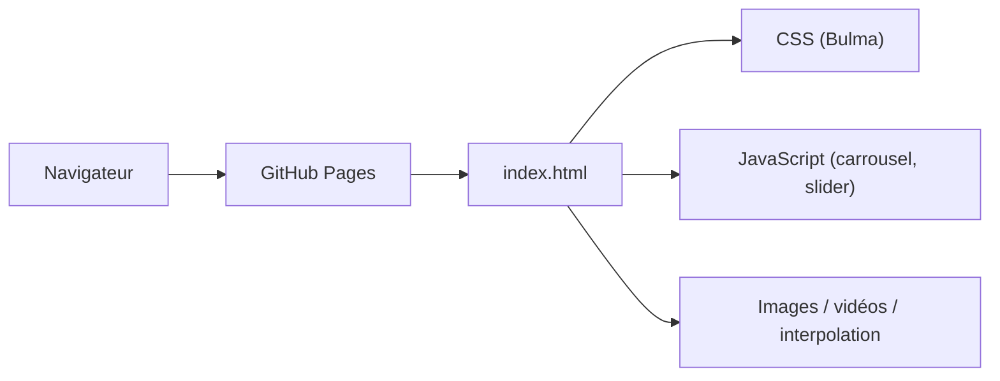

# nerfies/nerfies.github.io

> Code source du site web du projet de recherche Nerfies (champs de radiance neuronaux déformables).

## Le problème
Présenter un article de recherche avec vidéos et comparaisons interactives sur une page publique.

## Ce que ça fait vraiment
Le README ne contient que la description du dépôt et la citation BibTeX de l'article ICCV 2021. D'après le schéma, c'est un site statique (`index.html`, CSS Bulma, carrousels JS, images, vidéos, dossier `interpolation/`), sans backend ni code du modèle.

## Comment c'est branché


## Essayer
```bash
# Aucune commande documentée.
```

## Coût et pièges
Aucun coût. Aucune licence déclarée : réutiliser le modèle de page n'est pas clairement autorisé. Dernier push le 2024-06-21.

## Ce que ce n'est pas
Ce n'est pas l'implémentation de Nerfies ni un jeu de données : uniquement la page web.

## Alternatives
Aucune alternative nommée dans le README.

## Pour toi
À ignorer : ce n'est qu'une page vitrine sans code de modèle, et sans licence tu ne peux pas la réutiliser sereinement comme gabarit.
