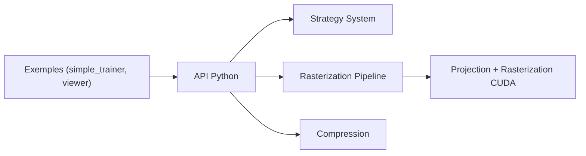

# nerfstudio-project/gsplat

> Bibliothèque de rastérisation CUDA de gaussiennes avec liaisons Python, pour la reconstruction 3D par splatting.

## Le problème
L'implémentation officielle du 3D Gaussian Splatting consomme de la mémoire GPU et manque de fonctionnalités pour l'expérimentation.

## Ce que ça fait vraiment
Noyaux CUDA de projection et de rastérisation appelés depuis PyTorch, avec stratégies de densification (défaut, MCMC), compression, entraînement distribué, caméras et capteurs variés (fisheye, LiDAR), 3DGUT, et un chemin d'inférence expérimental (HiGS). Le README annonce reproduire les métriques de l'implémentation officielle avec jusqu'à 4× moins de mémoire GPU et 15 % de temps en moins.

## Comment c'est branché


## Essayer
```bash
pip install gsplat
pip install git+https://github.com/nerfstudio-project/gsplat.git
python -m pip install -e .
cd examples
python -m pip install -r requirements.txt
bash benchmarks/basic.sh
```

## Coût et pièges
Gratuit. Installer PyTorch d'abord. Via PyPI, le code CUDA est compilé au premier lancement ; roues précompilées seulement pour certaines combinaisons Python/torch/CUDA. La branche principale (v1.6.0, PyTorch 2.7+) n'est pas encore sur PyPI.

## Ce que ce n'est pas
Pas une application de capture ni un outil clé en main : c'est une brique à intégrer. Le chemin d'inférence HiGS est expérimental.

## Alternatives
Aucune alternative nommée dans le README (l'implémentation officielle sert de référence).

## Pour toi
À adopter si tu travailles sur le splatting gaussien avec GPU NVIDIA ; hors sujet sinon.

