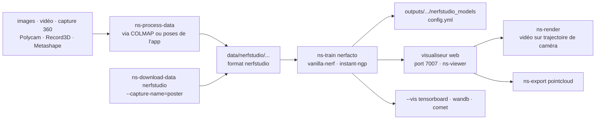

# nerfstudio-project/nerfstudio

> **Command-line pipeline to train, watch and export neural radiance fields from ordinary captures.**

## The problem

Every NeRF paper ships its own repository, its own data format, its own training loop and no way
to see what is happening while it runs. Going from a phone video to a 3D render means wiring
camera-pose estimation, format conversion, training and export yourself — with different code at
each step and for each method you try.

## What it actually does

Nerfstudio puts those steps behind four commands: `ns-process-data` converts images, a video, a
360 capture or a mobile-app capture into its own format, `ns-train` trains, `ns-viewer` reopens a
trained model, `ns-export` produces a point cloud. The README states that NeRF components are
modularized, so a model can be recomposed instead of starting from a whole separate repository.

The recommended model for real-world scenes is *nerfacto*; `vanilla-nerf` reproduces the original
NeRF and `ns-train --help` lists the rest. The web viewer runs alongside training: you navigate
the scene, place camera keyframes to build a trajectory, and the "RENDER" panel hands back the
`ns-render` command to paste into a terminal. The "EXPORT" tab does the same for point clouds.

Experiment tracking goes through `--vis`, which accepts `viewer`, `tensorboard`, `wandb`, `comet`
and combinations. The README warns that the viewer only holds up for fast methods (nerfacto,
instant-ngp), that slower methods should use the other loggers, and that combining the viewer
with wandb or tensorboard may stutter during evaluation steps.

Camera-pose estimation is not done by nerfstudio: it is delegated to COLMAP for raw images and
video, or taken from capture apps (Polycam, KIRI Engine, Record3D, Spectacular AI, Metashape,
RealityCapture, ODM, Project Aria).

## How it is wired



No code-derived diagram exists for this repository: this graph is reconstructed from the README
alone. The point worth keeping is that the viewer is not only an output — it is where the camera
trajectory and the crop are composed, and it returns a **command** to run elsewhere, not a file.
The declared foundations are `tyro` for command-line configuration and `nerfacc` for render
acceleration.

## Trying it

```bash
conda create --name nerfstudio -y python=3.8
conda activate nerfstudio
pip install --upgrade pip
```

CUDA 11.8 dependencies, then installation:

```bash
pip install torch==2.1.2+cu118 torchvision==0.16.2+cu118 --extra-index-url https://download.pytorch.org/whl/cu118

conda install -c "nvidia/label/cuda-11.8.0" cuda-toolkit
pip install ninja git+https://github.com/NVlabs/tiny-cuda-nn/#subdirectory=bindings/torch

pip install nerfstudio
```

First training run, then resuming and viewing:

```bash
# Download some test data:
ns-download-data nerfstudio --capture-name=poster
# Train model
ns-train nerfacto --data data/nerfstudio/poster

ns-train nerfacto --data data/nerfstudio/poster --load-dir {outputs/.../nerfstudio_models}
ns-viewer --load-config {outputs/.../config.yml}
ns-export pointcloud --help
```

## Cost and traps

- **An NVIDIA card with CUDA is required**, with no documented alternative: the README opens its
  prerequisites on that, and reports testing with CUDA 11.8 (and 11.7 for PyTorch). No VRAM
  figure is given — measure it yourself.
- **`tiny-cuda-nn` is compiled**: installed from GitHub with `ninja` and requiring the
  `cuda-toolkit`. This is the step that breaks, and it depends on the exact agreement between
  CUDA version, PyTorch version and compiler.
- **The documented stack is pinned low**: `python=3.8`, `torch==2.1.2+cu118`. The README asks for
  `python >= 3.8` but every example targets 3.8; a recent environment leaves the tested path.
- **COLMAP is a hidden cost**: for arbitrary images or video it does the pose estimation, it is
  installed separately, and the README marks it as the slow route (🐢) against mobile apps (🐇).
- **The fast routes go through third-party apps**: Polycam, KIRI Engine, Record3D, Metashape,
  RealityCapture — apps to install, sometimes on iOS with LiDAR, sometimes commercial. The README
  says nothing about their pricing.
- **Remote machines**: the viewer listens on a websocket port, 7007 by default, which you must
  port-forward yourself.
- **The repository itself is free and Apache-2.0**; wandb and Comet stay optional, they require an
  account, and Tensorboard or the local viewer are enough.

## What it is not

- **Not photogrammetry software**: nerfstudio does not compute camera poses. Without COLMAP or a
  capture app supplying them, there is nothing to train on.
- **Not a pretrained model or a reconstruction service**: every scene is trained from scratch on
  your own machine, every time.
- **Not a mesh generator**: the README states that NeRF models are not designed to generate point
  clouds and that exporting them is possible but off-label. Nothing is claimed about a usable mesh
  downstream.
- **Not a finished product for non-specialists**: the README presents a contributor-oriented
  repository born from a Berkeley research project (SIGGRAPH 2023), and sends customization to the
  pipeline documentation.
- **Not hardware-agnostic**: no CPU path, no documented AMD path.

## Alternatives

The README names no competing project: `tyro` and `nerfacc` appear as building blocks it uses,
not as substitutes. The catalogue's suggested neighbours (`roboflow/supervision`,
`JaidedAI/EasyOCR`, `PeterL1n/RobustVideoMatting`, `Mr-Homeless/waldo`) are all 2D vision —
detection, text recognition, video matting — and none reconstructs a 3D scene or trains a
radiance field: no comparable alternative in the catalogue.

## For you

Worth adopting if 3D reconstruction from images is in scope: this is the framework that saves you
from stitching four research repositories together, and the in-training viewer is a real
diagnostic time-saver. Skip it without an NVIDIA GPU — the question does not arise. The reflex
before investing: check the current state of the stack, since the README documents an already
dated CUDA 11.8 / PyTorch 2.1 / Python 3.8 combination.
