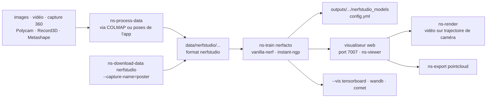

# nerfstudio-project/nerfstudio

> **Chaîne complète en ligne de commande pour entraîner, visualiser et exporter des champs de radiance neuronaux.**

## Le problème

Chaque publication sur les NeRF arrive avec son propre dépôt, son propre format de données, sa
propre boucle d'entraînement et aucun moyen de regarder ce qui se passe pendant que ça tourne.
Passer d'une vidéo prise au téléphone à un rendu 3D suppose d'enchaîner soi-même estimation de
poses de caméra, conversion de format, entraînement, puis export — avec un code différent à
chaque étape et à chaque méthode essayée.

## Ce que ça fait vraiment

Nerfstudio unifie ces étapes derrière quatre commandes : `ns-process-data` convertit des images,
une vidéo, une capture 360 ou une sortie d'application mobile vers le format maison,
`ns-train` entraîne, `ns-viewer` rouvre un modèle entraîné, `ns-export` sort un nuage de points.
Le README annonce que les composants des NeRF sont modularisés, ce qui permet de recomposer un
modèle plutôt que de repartir d'un dépôt entier.

Le modèle recommandé pour les scènes réelles s'appelle *nerfacto* ; `vanilla-nerf` reproduit le
NeRF d'origine et `ns-train --help` donne la liste complète. Le visualiseur web accompagne
l'entraînement en temps réel : on y navigue dans la scène, on pose des images-clés de caméra
pour construire une trajectoire, et le panneau « RENDER » recrache la commande `ns-render` à
coller dans un terminal. L'onglet « EXPORT » fait de même pour le nuage de points.

Le suivi d'expériences passe par `--vis` qui accepte `viewer`, `tensorboard`, `wandb`, `comet`
et leurs combinaisons. Le README prévient que le visualiseur ne tient que pour les méthodes
rapides (nerfacto, instant-ngp) et qu'il faut basculer sur les autres journaux pour les
méthodes lentes, le cumul pouvant provoquer des saccades aux étapes d'évaluation.

L'estimation des poses de caméra n'est pas faite par nerfstudio : elle est déléguée à COLMAP
pour les images et vidéos brutes, ou récupérée des applications de capture (Polycam, KIRI
Engine, Record3D, Spectacular AI, Metashape, RealityCapture, ODM, Project Aria).

## Comment c'est branché



Aucun diagramme tiré du code n'existe pour ce dépôt : ce schéma est reconstruit depuis le seul
README. Le point à retenir est que le visualiseur n'est pas seulement une sortie : c'est là
qu'on compose la trajectoire de caméra et le recadrage, et il rend une **commande** à exécuter
ailleurs, pas un fichier. Le socle technique déclaré est `tyro` pour la configuration en ligne
de commande et `nerfacc` pour l'accélération du rendu.

## Essayer

```bash
conda create --name nerfstudio -y python=3.8
conda activate nerfstudio
pip install --upgrade pip
```

Dépendances CUDA 11.8, puis installation :

```bash
pip install torch==2.1.2+cu118 torchvision==0.16.2+cu118 --extra-index-url https://download.pytorch.org/whl/cu118

conda install -c "nvidia/label/cuda-11.8.0" cuda-toolkit
pip install ninja git+https://github.com/NVlabs/tiny-cuda-nn/#subdirectory=bindings/torch

pip install nerfstudio
```

Premier entraînement, puis reprise et visualisation :

```bash
# Download some test data:
ns-download-data nerfstudio --capture-name=poster
# Train model
ns-train nerfacto --data data/nerfstudio/poster

ns-train nerfacto --data data/nerfstudio/poster --load-dir {outputs/.../nerfstudio_models}
ns-viewer --load-config {outputs/.../config.yml}
ns-export pointcloud --help
```

## Coût et pièges

- **Une carte NVIDIA avec CUDA est exigée**, sans alternative documentée : le README ouvre les
  prérequis là-dessus et indique avoir été testé avec CUDA 11.8 (et 11.7 pour PyTorch). Aucune
  quantité de VRAM n'est donnée — à mesurer soi-même.
- **`tiny-cuda-nn` se compile** : il s'installe depuis GitHub avec `ninja` et réclame le
  `cuda-toolkit`. C'est l'étape qui casse, et elle dépend de l'accord exact entre version de
  CUDA, version de PyTorch et compilateur.
- **La pile documentée est figée bas** : `python=3.8`, `torch==2.1.2+cu118`. Le README exige
  `python >= 3.8` mais tout l'exemple est écrit pour 3.8 ; un environnement récent sort du
  chemin testé.
- **COLMAP est un coût caché** : pour des images ou une vidéo quelconques, c'est lui qui fait
  l'estimation de poses, il s'installe à part, et le README le note comme la voie lente (🐢)
  face aux applications mobiles (🐇).
- **Les voies rapides passent par des applications tierces** : Polycam, KIRI Engine, Record3D,
  Metashape, RealityCapture — applications à installer, parfois sur iOS avec LiDAR, parfois
  commerciales. Le README ne dit rien de leurs tarifs.
- **Machine distante** : le visualiseur écoute un port websocket, 7007 par défaut, à faire
  suivre soi-même.
- **Le dépôt lui-même est gratuit et sous Apache-2.0** ; wandb et Comet restent facultatifs,
  ils demandent un compte, Tensorboard ou le visualiseur local suffisent.

## Ce que ce n'est pas

- **Ce n'est pas un logiciel de photogrammétrie** : nerfstudio ne calcule pas les poses de
  caméra. Sans COLMAP ou une application de capture qui les fournit, il n'y a rien à entraîner.
- **Ce n'est pas un modèle pré-entraîné ni un service de reconstruction** : chaque scène
  s'entraîne depuis zéro sur sa propre machine, à chaque fois.
- **Ce n'est pas un générateur de maillage** : le README précise que les modèles NeRF ne sont
  pas conçus pour produire des nuages de points, et que l'export en reste possible mais détourné.
  Rien n'est annoncé sur un maillage exploitable en aval.
- **Ce n'est pas un produit fini pour non-spécialiste** : le README se présente comme un dépôt
  orienté contributeurs, issu d'un projet de recherche de Berkeley (SIGGRAPH 2023), et renvoie
  la personnalisation à la documentation des pipelines.
- **Ce n'est pas indépendant du matériel** : pas de chemin CPU, pas de chemin AMD documenté.

## Alternatives

Le README ne nomme aucun projet concurrent : `tyro` et `nerfacc` y figurent comme briques
utilisées, pas comme substituts. Les voisins proposés par le catalogue
(`roboflow/supervision`, `JaidedAI/EasyOCR`, `PeterL1n/RobustVideoMatting`,
`Mr-Homeless/waldo`) relèvent tous de la vision 2D — détection, reconnaissance de texte,
détourage vidéo — et aucun ne reconstruit une scène 3D ni n'entraîne de champ de radiance :
aucune alternative comparable dans le catalogue.

## Pour toi

À adopter si la reconstruction 3D depuis des images entre dans le périmètre : c'est le cadre
qui évite d'assembler à la main quatre dépôts de recherche, et le visualiseur en cours
d'entraînement est un vrai gain de temps de diagnostic. À laisser de côté sans GPU NVIDIA, la
question ne se pose pas. Le réflexe avant d'investir : vérifier l'état actuel de la pile, le
README documentant une combinaison CUDA 11.8 / PyTorch 2.1 / Python 3.8 déjà datée.
