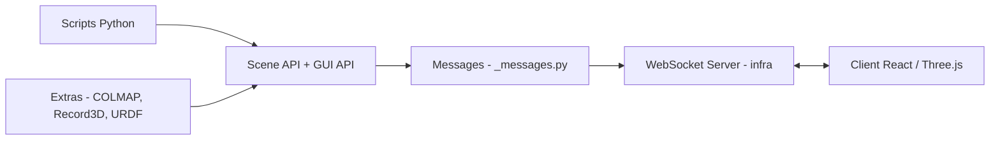

# nerfstudio-project/viser

> Bibliothèque Python de visualisation 3D interactive pour la vision par ordinateur et la robotique, avec client web.

## Le problème
Visualiser des nuages de points, des poses de caméra ou des modèles 3D depuis du Python demande souvent une interface lourde, difficile à utiliser à distance.

## Ce que ça fait vraiment
Une API Python dessine des primitives 3D, construit des éléments d'interface (boutons, sliders, champs), gère clics, sélections et gizmos de transformation, et pilote la caméra. Le client est entièrement web (React et Three.js), donc utilisable via SSH. Serveur et client échangent par WebSocket et sérialisation msgpack. Des visualiseurs additionnels existent pour COLMAP, Record3D et URDF.

## Comment c'est branché


## Essayer
```bash
pip install viser            # Core dependencies only.
pip install viser[examples]  # To include example dependencies.
```

## Coût et pièges
Gratuit, aucun prérequis matériel cité. Les exemples demandent des dépendances supplémentaires (`viser[examples]`).

## Ce que ce n'est pas
Ce n'est pas un moteur de rendu de production ni un outil de tracé de graphiques statistiques : c'est un outil de visualisation 3D interactive.

## Alternatives
Aucune alternative nommée dans le README.

## Pour toi
À adopter si tu fais de la vision 3D ou de la robotique : installation simple par pip et affichage dans le navigateur, même sur serveur distant.

