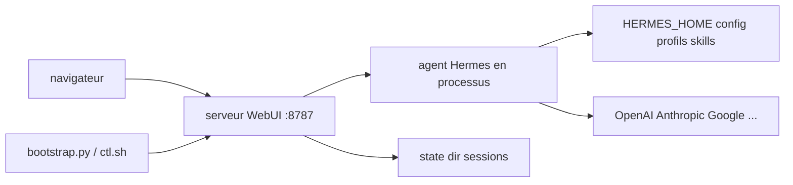

# nesquena/hermes-webui

> Interface web sombre pour l'agent Hermes, à parité avec sa CLI, sans build ni framework.

## Le problème
Un agent auto-hébergé qui tourne en permanence sur un serveur ne se pilote qu'en SSH depuis un terminal.
Depuis un téléphone ou une machine d'emprunt, c'est inconfortable, et l'historique n'est pas lisible.

## Ce que ça fait vraiment
Trois panneaux : sessions à gauche, chat au centre, explorateur de fichiers du workspace à droite.
Réponses en flux SSE, cartes d'appel d'outil, rendu Mermaid, blocs de raisonnement repliables, approbation des commandes risquées.
Panneaux Tâches (cron), Skills, Mémoire (MEMORY.md, USER.md), Profils, Todos, Spaces dans le Control Center.
Authentification optionnelle : mot de passe, passkeys WebAuthn, ou OIDC natif ; cookie HMAC signé de 24 h.

## Comment c'est branché


## Essayer
```bash
git clone https://github.com/nesquena/hermes-webui.git hermes-webui
cd hermes-webui
python3 bootstrap.py
```
En démon : `./ctl.sh start`, `./ctl.sh status`, `./ctl.sh logs --lines 100`, `./ctl.sh stop`.
Paquet Nix : `nix shell github:nesquena/hermes-webui#default`.

## Coût et pièges
Il lui faut l'agent Hermes installé (le bootstrap tente l'installateur officiel par `curl | bash`) et tes
propres clés de fournisseur. Windows natif n'est pas supporté par le bootstrap : Linux, macOS ou WSL2.

## Ce que ce n'est pas
Pas un agent : c'est une façade sur hermes-agent, qui tourne en processus et lit `HERMES_HOME` directement.
Pas un client d'API distante : `HERMES_API_URL` ne sert qu'à la sonde de santé cron, il ne route pas le chat.
Pas la délégation complète de boucle d'agent : elle n'est pas livrée, elle est suivie dans un ticket.

## Alternatives
`OpenClaw` — le concurrent que le README désigne lui-même comme le plus proche, avec marketplace de skills.
`OpenCode` — cité comme l'autre projet offrant une interface web auto-hébergée.
`Claude Code` / `Codex CLI` — si tu ne veux pas de mémoire persistante ni de cron auto-hébergé.

## Pour toi
Ne t'intéresse que si tu utilises déjà hermes-agent ; le tableau comparatif du README est un argumentaire, lis-le comme tel.
