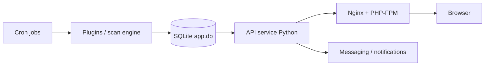

# netalertx/NetAlertX

> Inventaire auto-hébergé des appareils d'un réseau, avec alertes sur les nouveaux venus, pour homelabs et équipes IT.

## Le problème
On ne sait pas quels appareils sont branchés sur un réseau, ni quand un matériel inconnu apparaît ou disparaît.

## Ce que ça fait vraiment
Découvre les appareils (arp-scan, imports Pi-hole, DHCP, contrôleur UniFi, routeur SNMP) et les stocke dans une base SQLite locale. Un backend Python expose API, GraphQL et SSE ; une interface PHP derrière nginx affiche appareils, événements, présence. Des workflows classent ou nettoient les appareils, et plus de 80 services reçoivent les notifications. Des nœuds de synchronisation remontent plusieurs sites vers un hub.

## Comment c'est branché


## Essayer
```bash
docker run -d --network=host --restart unless-stopped \
  --cap-add=NET_RAW --cap-add=NET_ADMIN --cap-add=NET_BIND_SERVICE \
  -v /local_data_dir:/data -e PORT=20211 \
  ghcr.io/netalertx/netalertx:latest
git clone https://github.com/netalertx/NetAlertX.git
docker compose up --force-recreate --build
```

## Coût et pièges
Gratuit. Il faut Docker en `--network=host` avec des capacités réseau élevées, et sauvegarder `/data/config` et `/data/db`. Le README recommande un reverse proxy avec authentification. Le compose a changé récemment : lire le guide de migration.

## Ce que ce n'est pas
Ni un système de supervision d'infrastructure ni un SIEM. À utiliser uniquement sur des réseaux dont tu as la responsabilité : il scanne et conserve des métadonnées sur les appareils. Licence GPL-3.0 (copyleft).

## Alternatives
- Fing : application commerciale et propriétaire.
- NetBox : référence pour la source de vérité et l'IPAM.
- Zabbix ou Nagios : supervision d'infrastructure.

## Pour toi
Adopter pour un homelab ou un parc où tu veux savoir ce qui se connecte : installation Docker simple, données locales par défaut, projet actif.
