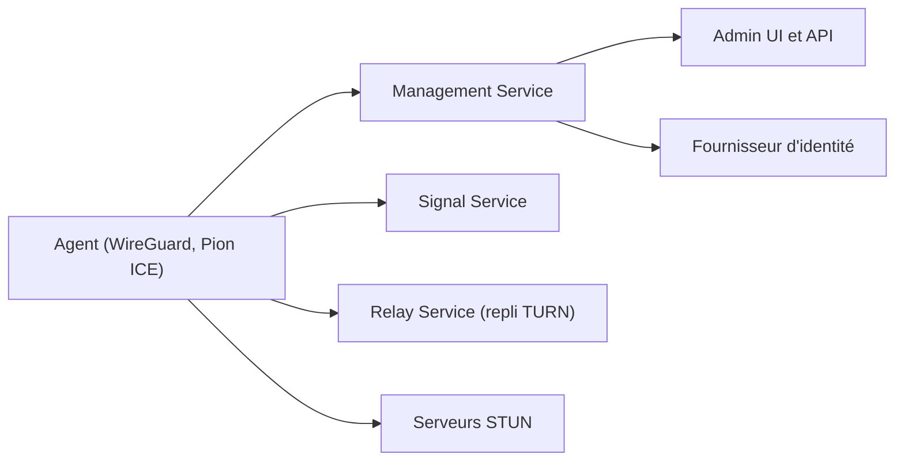

# netbirdio/netbird

> Réseau privé virtuel WireGuard sans configuration, avec contrôle d'accès centralisé, en cloud ou auto-hébergé.

## Le problème
Relier machines et sites sans ouvrir de ports ni gérer de passerelles VPN et règles de pare-feu est lourd et fragile.

## Ce que ça fait vraiment
Chaque machine exécute un agent qui pilote WireGuard, contacte le service de gestion (IP, règles, mises à jour) et négocie la connexion pair à pair via ICE/STUN et le service de signalisation ; en cas d'échec (NAT strict), un relais prend le trafic. Interface d'administration, SSO et MFA, groupes et règles d'accès, DNS privé, routes vers réseaux externes, API publique, Terraform et Ansible. Bêta annoncée : réseau d'agents IA.

## Comment c'est branché


## Essayer
```bash
export NETBIRD_DOMAIN=netbird.example.com; curl -fsSL https://github.com/netbirdio/netbird/releases/latest/download/getting-started.sh | bash
```

## Coût et pièges
Auto-hébergement : VM Linux d'au moins 1 CPU et 2 Go, ports TCP 80 et 443 et UDP 3478 ouverts, nom de domaine public, Docker Compose v2. Tarifs du cloud non précisés dans le README. Le script est exécuté par pipe vers bash.

## Ce que ce n'est pas
Ce n'est pas sous une licence unique : BSD-3-Clause, sauf management/, signal/ et relay/ en AGPLv3. Il ne remplace pas un pare-feu périmétrique complet.

## Alternatives
Aucune alternative citée dans le README.

## Pour toi
À surveiller : pertinent pour relier en privé serveurs GPU, notebooks et clusters, mais la licence mixte AGPL demande une vérification avant intégration.

