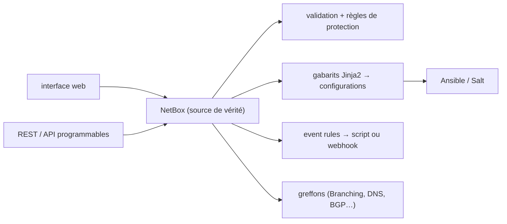

# netbox-community/netbox

> Source de vérité pour l'infrastructure réseau : modélisation IPAM et DCIM, avec API programmables.

## Le problème
L'état voulu d'un réseau vit dans des tableurs et des têtes : câbles, baies, VLAN, adresses IP,
circuits et alimentations n'ont pas de modèle commun, donc aucune automatisation fiable.

## Ce que ça fait vraiment
Un modèle de données prêt à l'emploi et fortement interconnecté (baies, équipements, câbles, adresses
IP, VLAN, circuits, alimentation, VPN), exposé par une interface web et des API. NetBox ne parle pas
aux équipements : il définit et valide l'état *voulu*, et le met à disposition des outils
d'automatisation. Champs personnalisés, étiquettes, greffons, permissions granulaires, règles de
validation et de protection personnalisées, rendu de configurations Jinja2 récupérables par API,
scripts personnalisés lançables depuis l'UI, règles d'événement déclenchant script ou webhook,
et journal de changements complet groupé par identifiant de requête.

## Comment c'est branché

## Essayer
Aucune commande n'est documentée dans ce README : il renvoie à la démonstration publique et à la
documentation officielle.

## Coût et pièges
Gratuit en version Community ; NetBox Cloud et NetBox Enterprise sont des offres commerciales du même
éditeur. Le README ne donne ni prérequis, ni procédure d'installation, ni licence. Le coût caché est
la saisie initiale : une source de vérité n'a de valeur qu'exhaustive et tenue à jour.

## Ce que ce n'est pas
Le README le dit explicitement : NetBox n'interagit pas avec les équipements réseau, et refuse la
posture d'outil tout-en-un. Ce n'est ni un système de supervision, ni un moteur de déploiement —
la séparation des rôles est revendiquée comme un choix d'architecture.

## Alternatives
- NetBox Branching : greffon pour travailler sur des branches isolées et fusionnables.
- NetBox Custom Objects : greffon pour définir de nouveaux types d'objets depuis l'UI.
- NetBox Cloud / Enterprise : les versions hébergées et commerciales.

## Pour toi
Hors sujet pour la data, sauf si tu dois aller chercher un inventaire réseau comme source de données.
