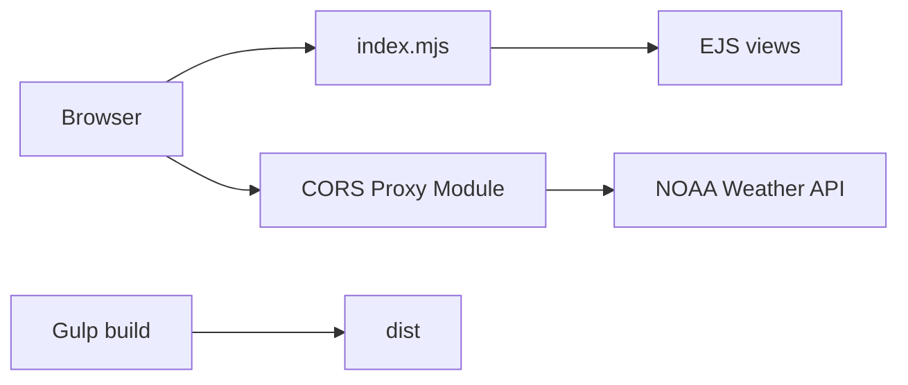

# netbymatt/ws4kp

> Simulation web nostalgique de la chaîne météo WeatherStar 4000 des années 90, alimentée par l'API NOAA.

## Le problème
Retrouver l'ambiance d'un bulletin météo des années 90 avec des prévisions actuelles, sans configuration lourde.

## Ce que ça fait vraiment
Une application Node (Express, EJS) sert une interface qui enchaîne des écrans : conditions actuelles, prévisions locales et étendues, radar, graphique horaire, perspectives SPC, almanach. Elle interroge api.weather.gov, uniquement pour les États-Unis. Deux modes : serveur avec cache-proxy, ou statique (nginx). Modes kiosque, permaliens, musique personnalisable.

## Comment c'est branché


## Essayer
```bash
git clone https://github.com/netbymatt/ws4kp.git
cd ws4kp
npm install
npm start
docker run -p 8080:8080 ghcr.io/netbymatt/ws4kp
```

## Coût et pièges
Gratuit. Dépendance à l'API NOAA, parfois en panne selon les régions. Le README indique ne pas utiliser le site en situation météo dangereuse.

## Ce que ce n'est pas
Pas une réplique fidèle du matériel WeatherStar. Ne fonctionne pas hors des États-Unis (une variante internationale est citée).

## Alternatives
Le README cite ws4kp-international et le WS4000 Simulator.

## Pour toi
À ignorer : divertissement nostalgique, sans usage data, IA ou MLOps ; garde-le pour un écran d'ambiance.

