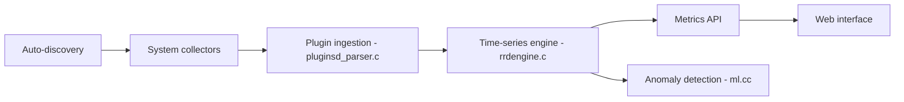

# netdata/netdata

> Agent de supervision d'infrastructure temps réel, par seconde, avec ML d'anomalies, pour admins et DevOps.

## Le problème
Les outils de monitoring offrent peu de métriques, à basse résolution, et coûtent cher à faire passer à l'échelle.

## Ce que ça fait vraiment
Un agent découvre automatiquement les ressources, collecte les métriques à la seconde, les stocke localement (base temporelle à paliers) et entraîne un modèle ML par métrique pour détecter les anomalies. Il évalue des alertes, expose un tableau de bord web et une API, exporte vers Prometheus/InfluxDB/Graphite et peut streamer vers un « Parent ». Netdata Cloud est optionnel.

## Comment c'est branché

## Essayer
Le README renvoie aux guides d'installation par plateforme (Linux, macOS, FreeBSD, Windows, Docker, Kubernetes) sans commande en ligne. Interface à `http://localhost:19999`. Désactiver la télémétrie : option `--disable-telemetry` de l'installeur.

## Coût et pièges
Agent gratuit ; Cloud avec offre gratuite. Compter environ 5 % de CPU et 150 Mo de RAM par défaut (chiffres du README). Télémétrie anonyme activée par défaut.

## Ce que ce n'est pas
Pas entièrement GPL : l'interface (Netdata UI) est sous licence NCUL1 distincte, et Cloud est une offre propriétaire. Pas un outil de logs/traces complet.

## Alternatives
- Prometheus + Grafana : le README les compare, plus de configuration mais écosystème standard.

## Pour toi
À surveiller : utile pour observer des serveurs d'entraînement ou d'inférence sans configuration, mais vérifier le périmètre GPL/NCUL1 et couper la télémétrie avant tout déploiement.

