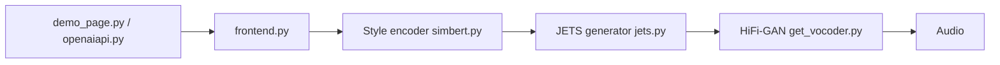

# netease-youdao/EmotiVoice

> Moteur de synthèse vocale anglais/chinois à plus de 2000 voix, avec émotion pilotée par prompt.

## Le problème
Les TTS libres offrent peu de voix et peu de contrôle sur l'émotion de la parole générée.

## Ce que ça fait vraiment
Convertit du texte en phonèmes, puis en audio via un modèle conditionné par un prompt de style et un locuteur (JETS + vocodeur HiFi-GAN dans le code). Fournit une interface web Streamlit, un script batch et une API compatible OpenAI. Le clonage de voix est annoncé depuis le 13 décembre 2023.

## Comment c'est branché


## Essayer
```bash
docker run -dp 127.0.0.1:8501:8501 syq163/emoti-voice:latest
pip install streamlit
streamlit run demo_page.py
uvicorn openaiapi:app --reload
```

## Coût et pièges
Le Docker demande un GPU NVIDIA ; l'installation manuelle exige de télécharger des modèles (simbert, checkpoints) via git-lfs ou ModelScope. Python 3.8 dans le README.

## Ce que ce n'est pas
Pas un service hébergé (la démo est sur Replicate). Anglais et chinois seulement ; japonais/coréen restent « en développement ».

## Alternatives
Aucune alternative nommée dans le README.

## Pour toi
À surveiller : utile pour prototyper de la voix expressive en local, mais l'installation est lourde et la pile (Python 3.8) vieillit.

