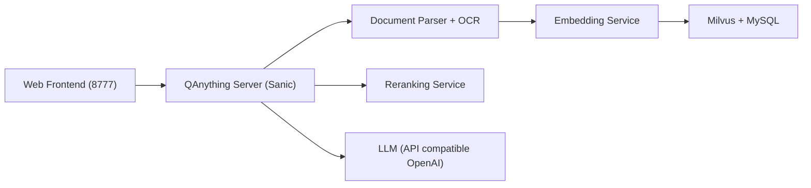

# netease-youdao/QAnything

> Système local de questions-réponses sur ses documents, avec récupération en deux étapes, installé par Docker Compose.

## Le problème
Interroger ses propres fichiers (PDF, Word, tableurs, pages web) sans envoyer ses données dans un service externe.

## Ce que ça fait vraiment
On dépose des fichiers dans une base ; ils sont analysés (PDF avec tableaux, OCR, Markdown, e-mails, CSV…), découpés en morceaux, vectorisés, puis stockés dans Milvus. À la question, une première recherche par plongement (BCEmbedding) est suivie d'un reclassement, avant l'appel à un LLM via une interface compatible OpenAI (Ollama recommandé en local). Modes : démarrage rapide, sans fichier, récupération seule, bots personnalisés.

## Comment c'est branché


## Essayer
```bash
git clone https://github.com/netease-youdao/QAnything.git
cd QAnything
docker compose -f docker-compose-linux.yaml up
docker compose -f docker-compose-linux.yaml down
```
Variantes `docker-compose-mac.yaml` et `docker-compose-win.yaml` ; interface sur `http://localhost:8777/qanything/`.

## Coût et pièges
Gratuit. Le README annonce 20 Go de RAM minimum et fonctionnement CPU. La v2.0 n'embarque plus de LLM local : il faut le fournir (Ollama ou API), avec le coût d'une API payante le cas échéant. Le README signale que les réponses avec Ollama local sont souvent faibles. AGPL-3.0 : obligations de partage si exposé en réseau.

## Ce que ce n'est pas
Ce n'est pas un modèle ni un moteur de recherche d'entreprise complet. La reconnaissance audio a été retirée en v2.0. Le support multi-cartes GPU a aussi disparu.

## Alternatives
Le README cite RAGFlow (idées de parsing) et Langchain-Chatchat (inspiration pour la base de connaissances locale).

## Pour toi
Surveiller : un RAG local prêt à lancer avec deux étages de récupération, utile pour comparer avec ta propre pile, mais lourd en RAM, AGPL et dépendant d'un LLM à fournir séparément.

