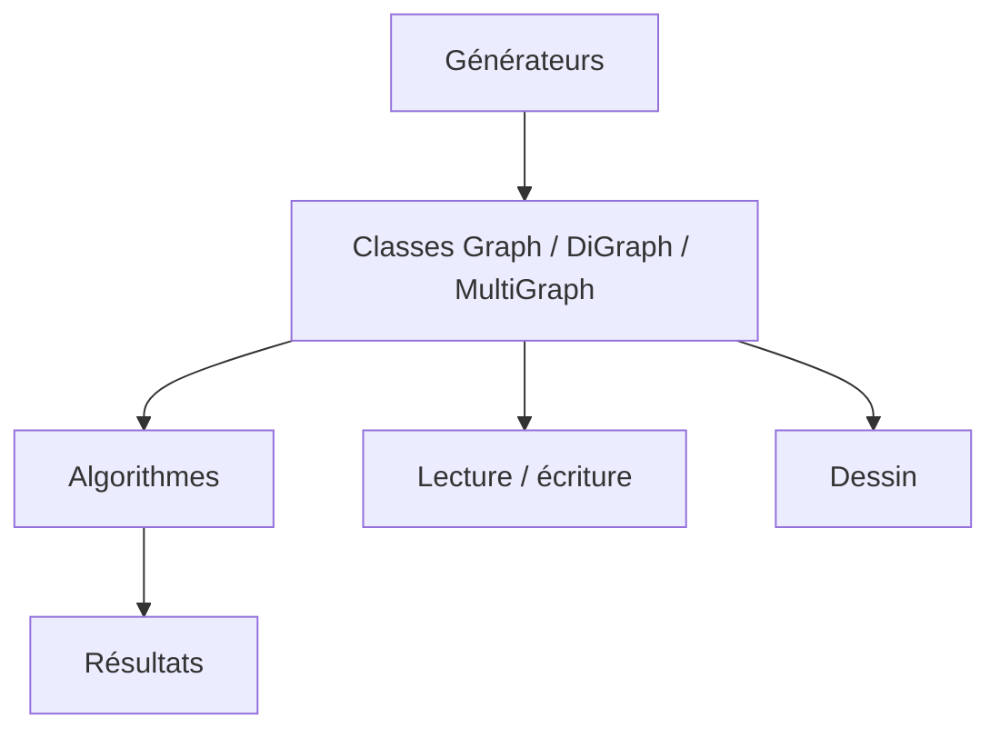

# networkx/networkx

> Bibliothèque Python pour créer, manipuler et analyser des graphes et réseaux complexes.

## Le problème
Modéliser des relations (réseaux sociaux, dépendances, flux) et calculer chemins, centralités ou communautés sans réimplémenter les algorithmes.

## Ce que ça fait vraiment
Fournit des classes de graphes (simple, orienté, multigraphe), des algorithmes (plus court chemin, centralité, communautés, flots, parcours), des générateurs de graphes classiques ou aléatoires, la lecture/écriture de formats (GraphML, GML, etc.) et le dessin. D'après le README, la licence est BSD 3 clauses, mais elle n'est pas reconnue automatiquement par GitHub. Le graphe d'architecture fourni est un guide générique, pas une lecture du code.

## Comment c'est branché


## Essayer
```bash
pip install networkx
pip install networkx[default]
```
```python
import networkx as nx
G = nx.Graph()
G.add_edge("A", "B", weight=4)
nx.shortest_path(G, "A", "D", weight="weight")
```

## Coût et pièges
Gratuit. Le README mentionne des dépendances optionnelles (extra `default`). Les graphes très gros restent lents, l'implémentation étant en Python pur, ce que le README ne précise pas.

## Ce que ce n'est pas
Ce n'est pas une base de données de graphes ni un outil de visualisation avancée.

## Alternatives
Le README n'en nomme aucune.

## Pour toi
À adopter : outil de référence pour la théorie des graphes en Python, utile en analyse de données, graphes de connaissances et pipelines.

