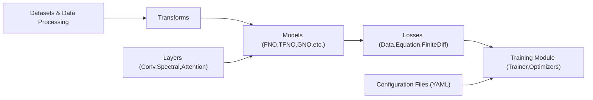

# neuraloperator/neuraloperator

> Bibliothèque PyTorch d'opérateurs neuronaux (dont FNO) qui apprennent des applications entre espaces de fonctions.

## Le problème
Un réseau classique apprend une correspondance à résolution fixe ; pour des équations aux dérivées partielles, on veut un opérateur appliqué à n'importe quelle résolution.

## Ce que ça fait vraiment
La bibliothèque fournit l'implémentation officielle du Fourier Neural Operator et d'autres architectures (`FNO`, `TFNO`, GNO…). Elle propose des variantes tensorisées (Tucker) avec moins de paramètres, des couches spectrales, des jeux de données, des fonctions de perte et un `Trainer`. Des scripts d'entraînement (Darcy, Burgers) et des fichiers YAML de configuration servent aux expériences ; l'écriture des journaux vers W&B est optionnelle. Elle fait partie de l'écosystème PyTorch.

## Comment c'est branché


## Essayer
```bash
pip install neuraloperator
git clone https://github.com/NeuralOperator/neuraloperator
cd neuraloperator
pip install -e .
pip install -r requirements.txt
```
Pour W&B, placer la clé dans `neuraloperator/config/wandb_api_key.txt`.

## Coût et pièges
Gratuit. Le README ne précise ni version de Python ni exigence GPU. Le suivi W&B exige un compte et une clé dans un fichier local : ne pas la commiter.

## Ce que ce n'est pas
Ce n'est pas une bibliothèque de deep learning généraliste : elle vise le ML scientifique (PDE, phénomènes physiques). La résolution invariante est une propriété du modèle, à vérifier sur tes données. Le README est en reStructuredText brut, peu lisible.

## Alternatives
Aucune alternative nommée dans le README.

## Pour toi
À surveiller : référence pour l'apprentissage d'opérateurs, mais de niche ; utile si tu fais du ML scientifique ou de la simulation, sans objet pour de la data ou du MLOps classiques.
