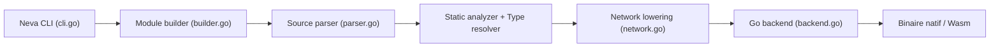

# nevalang/neva

> Langage de programmation à flux de données, typé statiquement, compilé vers Go, pour curieux de la concurrence.

## Le problème
Les langages classiques traitent la concurrence comme une option avancée et le flux de données reste sous-représenté. Les outils visuels de flux manquent d'expressivité.

## Ce que ça fait vraiment
Un programme est un réseau de nœuds qui échangent des messages par des ports ; tout s'exécute en parallèle par défaut. Le compilateur analyse les types, abaisse le réseau, puis émet du code Go (goroutines et canaux) qui devient binaire natif ou Wasm. Interopérabilité Go annoncée ; éditeur visuel marqué WIP.

## Comment c'est branché


## Essayer
```bash
# Aucune commande d'installation dans le README ; seul un exemple Hello, World! en .neva est fourni
```

## Coût et pièges
Gratuit, aucune clé. Chaîne Go requise en aval pour produire les binaires. Plusieurs détails de backend et runtime non documentés.

## Ce que ce n'est pas
Pas un outil de pipelines de données ni un framework ETL : c'est un langage généraliste. L'éditeur visuel n'est pas terminé. Écosystème de bibliothèques à vérifier.

## Alternatives
Aucune alternative nommée dans le README (il se compare à Go comme cible de compilation).

## Pour toi
À surveiller : intéressant conceptuellement pour la concurrence, mais sans écosystème data/IA, il ne remplace rien dans un flux MLOps aujourd'hui.

